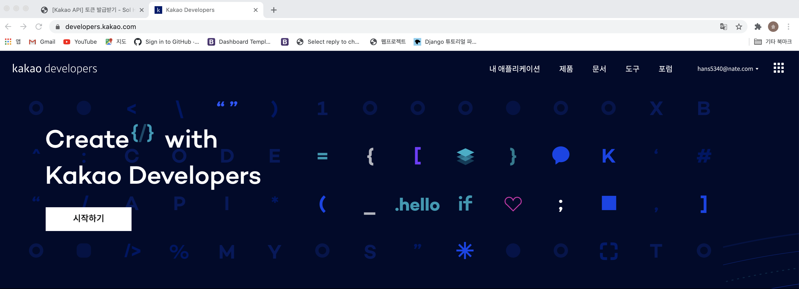
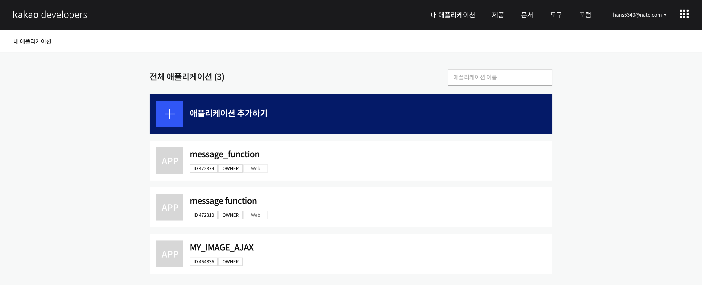
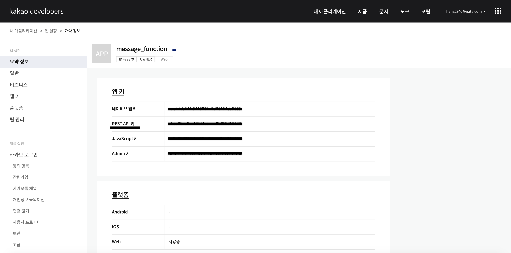

<h2>Kakao API</h2>

오늘은 `Kakao API`에 대하여 알아보겠습니다. 

저희는 Python 언어를 이용하여 API 를 이용해보도록 하겠습니다.

카카오 API 를 사용하기 위해서는 사용자 토큰을 발급받아야합니다.

하지만 토큰에는 사용횟수 제한이 있기 때문에 refresh 토큰을 통해 사용자 토큰을 초기화 해주어야 합니다.

이 글은 2020년 8월 20일에 작성되었으며 변동되면 업데이트하도록 하겠습니다.

<h3>사용자토큰 발급받기</h3>

여러분들이 직접 카카오에 있는 사용법을 보고 사용할 수 있도록 설명하겠습니다.

먼저 토큰을 발급받기 위해 [카카오 개발자 사이트](https://developers.kakao.com/)에 접속하여 회원가입합니다.

회원가입한후 로그인을 진행하고 오른쪽 상단에  `내 어플리케이션` 을 클릭합니다. 

회원가입한 후 로그인을 진행하고 오른쪽 상단에  `애플리케이션 추가하기` 을 클릭합니다. 

저희는 `REST API` 를 이용하여 사용할 예정이므로 REST API 키를 받아 사용하도록 하겠습니다.

