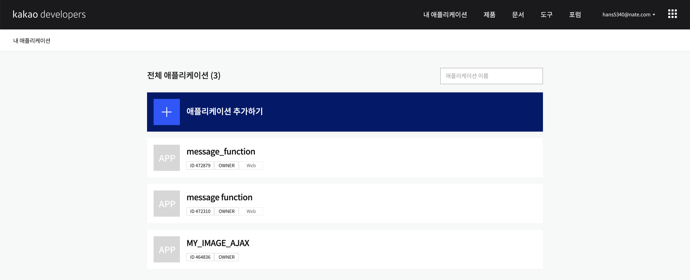

<h2>Kakao API [User token]</h2>

오늘은 `Kakao API`에 대하여 알아보겠습니다. 

저희는 Python 언어를 이용하여 API 를 이용해보도록 하겠습니다.

카카오 API 를 사용하기 위해서는 사용자 토큰을 발급받아야합니다.

하지만 토큰에는 사용시간  제한이 있기 때문에 refresh 토큰을 통해 사용자 토큰을 초기화 해주어야 합니다.

오늘은 사용자 토큰부터 받아보도록 하겠습니다.

 

토큰별 유효시간 

Android, iOS : 12시간 JavaScript: 2 시간 REST API : 6시간

Refresh Token : 2달

이 글은 2020년 8월 20일에 작성되었으며 변동되면 업데이트하도록 하겠습니다.


<h3>회원가입 및 로그인</h3>

여러분들이 직접 카카오에 있는 사용법을 보고 사용할 수 있도록 설명하겠습니다.

먼저 토큰을 발급받기 위해 [카카오 개발자 사이트](https://developers.kakao.com/)에 접속하여 회원가입합니다.


회원가입한후 로그인을 진행하고 오른쪽 상단에  `내 어플리케이션` 을 클릭합니다. 




회원가입한 후 로그인을 진행하고 오른쪽 상단에  `애플리케이션 추가하기` 을 클릭합니다. 


<h3>App key 발급받기</h3>


저희는 `REST API` 를 이용하여 사용할 예정이므로 REST API 키를 받아 사용하도록 하겠습니다.


<h3>활성화 설정</h3>


카카오톡 로그인을 하여 서비스를 이용할 예정이므로 제품설정 > 카카오톡 로그인 을 클릭합니다. 활성화 설정을 ON으로 변경하고 Redirect URl 에 원하시는 주소로 입력합니다.


<h3>인증 코드 받기</h3>

카카오톡 API 사용을 위하여 인증코드를 받아야합니다. [인증 코드 받기](https://developers.kakao.com/docs/latest/ko/kakaologin/rest-api#logout-of-service-and-kakaoaccount)  링크로 이동합니다.


```http
GET /oauth/authorize?client_id={REST_API_KEY}&redirect_uri={REDIRECT_URI}&response_type=code HTTP/1.1 
Host: kauth.kakao.com
```

상기 코드를 보고 발급받은 REST_API_KEY 와 REDIRECT_URI 을 추가하여 브라우저 주소창에 입력합니다.

``` http
kauth.kakao.com/oauth/authorize?client_id={REST_API_KEY}&redirect_uri={REDIRECT_URI}&response_type=code
```


입력 후 응답을 기다리면 하기와 같이 URl 이 변경됩니다.

```http
https://localhost.com/?code=JrFxxxxxxxxxxxxxxxxxxxxxxxxxxxxxxxxxxxxx
```

<u>JrFxxxxxxxxxxxxxxxxxxxxxxxxxxxxxxxxxxxxx</u> 가 저희가 사용할 코드입니다.


<h3>사용자 토큰 받기</h3>


<h4>응답값</h4>

##### Key

| Name                     | Type      | Description                                                  |
| :----------------------- | :-------- | :----------------------------------------------------------- |
| token_type               | `String`  | 토큰 타입, "bearer"로 고정                                   |
| access_token             | `String`  | 사용자 액세스 토큰 값                                        |
| expires_in               | `Integer` | 액세스 토큰 만료 시간(초)                                    |
| refresh_token            | `String`  | 사용자 리프레시 토큰 값                                      |
| refresh_token_expires_in | `Integer` | 리프레시 토큰 만료 시간(초)                                  |
| scope                    | `String`  | 인증된 사용자의 정보 조회 권한 범위 범위가 여러 개일 경우, 공백으로 구분 |


사용자 토큰을 받기위해 코드를 상기 URL 에서 필수요소들을 request하고 응답값을 .json 형식의 파일로 저장해보겠습니다. 


```python
import requests
import json
#
# 초기 키 땡기기
app_key = {REST_API_KEY} # 초기 앱키 rest_key
code = "JrFxxxxxxxxxxxxxxxxxxxxxxxxxxxxxxxxxxxxx"

url = "https://kauth.kakao.com/oauth/token"
data = {
     "grant_type"    : "authorization_code",
     "client_id"     : app_key,
     "redirect_url"  : "https://localhost.com",
     "code"          : code
}

response = requests.post(url, data=data)

tokens = response.json()

print(tokens)

with open("kakao_token.json", 'w') as fp:
    json.dump(tokens, fp) # 저장하는 것
```


`response = requests.post(url, data=data)` 코드를 통하여 post방식으로 요청하면 응답 값을 받을 수 있습니다.


``` python
with open("kakao_token.json", 'w') as fp:
    json.dump(tokens, fp)
```

상기 코드를 통하여 응답값을 `kakao_token.json` 이름의 .json 형태의 파일로 저장합니다.

이렇게 하여 저희는 사용자토큰을 kakao_token.json 파일에 넣어보았습니다. 사용자 토큰을 바로 사용하는 것도 가능하지만 .json 형태의 파일로 저장하여 구분하였습니다.


오늘은 카카오 API 사용자 토큰을 받아보았습니다.

