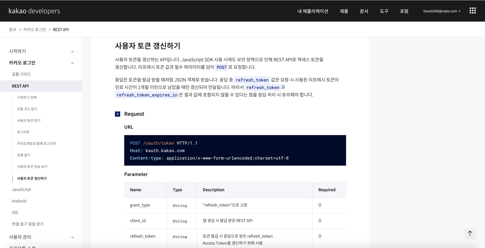

<h2>Kakao API [Refresh token]</h2>

오늘은 `Refresh token`에 대하여 알아보겠습니다. 

아직 사용자 토큰을 받지 못하신 분은 [[Kakao API] 사용자토큰](/api/kakao_api_usertoken/) 을 참고하여 사용자토큰을 먼저 받고 오시면 되겠습니다. Refresh token 토큰은 사용자 토큰을 받는방법과 비슷합니다.


<h3>Refresh token 받기</h3>

여러분들이 직접 카카오에 있는 사용법을 보고 사용할 수 있도록 설명하겠습니다.

먼저 refresh 토큰을 발급받기 위해 [사용자 토큰 갱신하기](https://developers.kakao.com/docs/latest/ko/kakaologin/rest-api) 항목을 참고합니다.





```http
POST /oauth/token HTTP/1.1
Host: kauth.kakao.com
Content-type: application/x-www-form-urlencoded;charset=utf-8
```

`Access token` 을 받는 것과 마찬가지로 하기 Request에서 어떤 값을 필수로 입력하여야 하는지 확인합니다.

### Request

##### Parameter

| Name          | Type     | Description                                                  | Required |
| :------------ | :------- | :----------------------------------------------------------- | :------- |
| grant_type    | `String` | "refresh_token"으로 고정                                     | O        |
| client_id     | `String` | 앱 생성 시 발급 받은 REST API                                | O        |
| refresh_token | `String` | 토큰 발급 시 응답으로 받은 refresh_token Access Token을 갱신하기 위해 사용 | O        |
| client_secret | `String` | 토큰 발급 시, 보안을 강화하기 위해 추가 확인하는 코드 [내 애플리케이션] > [보안]에서 설정 가능 ON 상태인 경우 필수 설정해야 함 | X        |


상기의 Request 를 정확히 하면 응답으로 하기 값을 받을수 있습니다. 즉 refresh token을 입력하면 `access_token`이 변경되는 구조입니다.

### Response

##### Key

| Name                     | Type      | Description                                                  |
| :----------------------- | :-------- | :----------------------------------------------------------- |
| token_type               | `String`  | 토큰 타입, "bearer"로 고정                                   |
| access_token             | `String`  | 갱신된 사용자 액세스 토큰 값                                 |
| expires_in               | `Integer` | 액세스 토큰 만료 시간(초)                                    |
| refresh_token            | `String`  | 갱신된 사용자 리프레시 토큰 값, 기존 리프레시 토큰의 유효기간이 1개월 미만인 경우에만 갱신 |
| refresh_token_expires_in | `Integer` | 리프레시 토큰 만료 시간(초)                                  |


더 밑으로 내려보면 `Sample Code`를 확인할 수 있습니다. 

### Sample

##### Request

```bash
curl -v -X POST https://kauth.kakao.com/oauth/token \
 -d 'grant_type=refresh_token' \
 -d 'client_id={REST_API_KEY}' \
 -d 'refresh_token={USER_REFRESH_TOKEN}'
```

`Sample` 코드를 바탕으로 Python에서 작업을 해보도록 하겠습니다.

Access token (usertoken) 은 [[Kakao API] 사용자토큰](/api/kakao_api_usertoken/) 에서 저장한 json 파일을 사용하도록 하겠습니다.

```python
with open("kakao_token.json", 'r') as fp:
    tokens = json.load(fp) # json 불러오기

print(tokens)

url = "https://kauth.kakao.com/oauth/token"
data = {
    "grant_type"     : "refresh_token",
    "client_id"      : app_key,
    "refresh_token"  : tokens['refresh_token']
}
#
response = requests.post(url, data=data)
response.status_code
response.json()
tokens['access_token'] = response.json()['access_token']
tokens['app_key'] = app_key

with open("kakao_token.json", 'w') as fp:
    json.dump(tokens, fp) # 저장하는 것
```


#### 코드설명

``` python
tokens['access_token'] = response.json()['access_token']
```

refresh token을 통해 다시 발급 받은 access_token을 json파일에 저장하여 갱신합니다.


오늘은 카카오 API를 사용하기 위하여 `Refresh token` 을 발급받아 보았습니다.