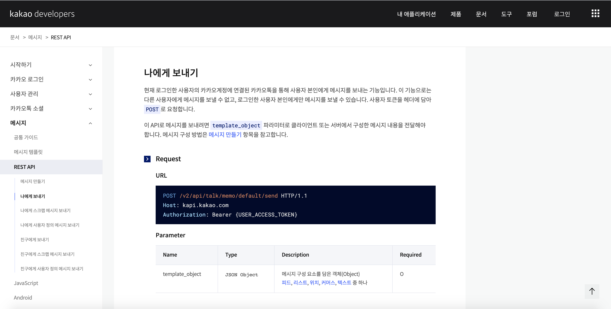
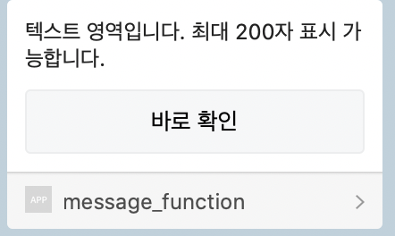

<h2>Kakao API [Refresh token]</h2>

오늘은 `카카오톡 나에게 메세지보내기`에 대하여 알아보겠습니다. 

토큰을 받지 못하신 분은 [[Kakao API] 사용자토큰](/api/kakao_api_usertoken/) , [[Kakao API] Refresh token](/api/kakao_api_refresh-token/) 을 참고하셔서 토큰을 선행해서 받아주세요.

<h3>카카오톡 나에게 메세지 보내기</h3>

이번에도 여러분들이 직접 카카오에 있는 사용법을 보고 사용할 수 있도록 설명하겠습니다. 메세지를 보내기 위해 [나에게 보내기](https://developers.kakao.com/docs/latest/ko/message/rest-api#send-me) 항목을 참고합니다.



#### Request

```http
POST /v2/api/talk/memo/default/send HTTP/1.1
Host: kapi.kakao.com
Authorization: Bearer {USER_ACCESS_TOKEN}
```

##### Parameter

| Name            | Type          | Description                                                  | Required |
| :-------------- | :------------ | :----------------------------------------------------------- | :------- |
| template_object | `JSON Object` | 메시지 구성 요소를 담은 객체(Object) [피드](https://developers.kakao.com/docs/latest/ko/message/message-template#feed), [리스트](https://developers.kakao.com/docs/latest/ko/message/message-template#list), [위치](https://developers.kakao.com/docs/latest/ko/message/message-template#location), [커머스](https://developers.kakao.com/docs/latest/ko/message/message-template#commerce), [텍스트](https://developers.kakao.com/docs/latest/ko/message/message-template#text) 중 하나 | O        |

#### Response

##### Key

| Name        | Type      | Description    |
| :---------- | :-------- | :------------- |
| result_code | `Integer` | 전송 성공 시 0 |


#### Sample

``` python
curl -v -X POST "https://kapi.kakao.com/v2/api/talk/memo/default/send" \
    -H "Authorization: Bearer {USER_ACCESS_TOKEN}" \
    -d 'template_object={
        "object_type": "text",
        "text": "텍스트 영역입니다. 최대 200자 표시 가능합니다.",
        "link": {
            "web_url": "https://developers.kakao.com",
            "mobile_web_url": "https://developers.kakao.com"
        },
        "button_title": "바로 확인"
    }'
```

오늘은 텍스트를 보내보도록 하겠습니다. parameter에 텍스트를 클릭하여 하여도 가능하지만 아주쉽게 샘플코드를 복사하여 코드를 작성해보겠습니다.

``` python
with open("static/my_squat/kakao_token.json", 'r') as fp:
    tokens = json.load(fp)


url = "https://kapi.kakao.com/v2/api/talk/memo/default/send"
headers = {"Authorization": "Bearer " + tokens['access_token']}

template_object = {
		'object_type': 'text',
		'text': '텍스트 영역입니다. 최대 200자 표시 가능합니다.',
		'link': {
				'web_url': 'https://daum.net',
    },
    'button_title': '바로 확인'
}

data = {'template_object': json.dumps(template_object)}
# return request('post', url, data=data, json=json, **kwargs)
response = requests.post(url, headers=headers, data=data)
print(response.status_code)
```

샘플을 보고 작성을 하고 동일하게 작성을 해보았습니다. 


##### 코드설명

``` python
data = {'template_object': json.dumps(template_object)}
```

Data 는` template_object`이름으로 json 파일 형식으로 url을 통해 요청을 보냅니다. 

요청이 성공적으로 전송이 되면  <code>print(response.status_code)</code> 코드에서 200이라는 메세지와 함께 카카오톡 메세지를 확인할 수 있습니다.





오늘은 `카카오톡 나에게 보내기`를 해보았습니다. 궁금하시거나 안되는 기능이 있으면 언제든 댓글을 남겨주세요!