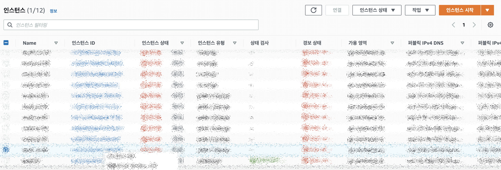
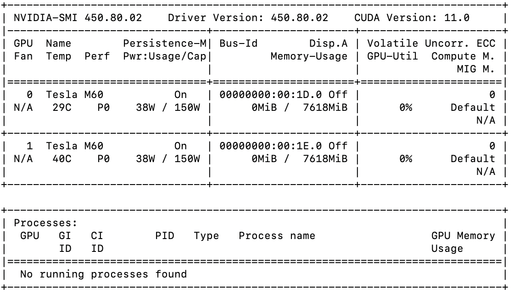

## AWS

오늘은 `AWS`의 사용방법에 대해 알아보도록 하겠습니다. 저는 Mac os 를 사용하므로 터미널을 이용하여 접속해보도록 하겠습니다. 윈도우 사용자분들은 Putty같은 접속프로그램을 사용하시면 손쉽게 접근하실 수 있습니다.

### 인스턴스 시작

EC2 서비스를 사용하시는 분이면 초기세팅을 완료하신 후에 우측상단의 인스턴스 시작을 누르시면 됩니다.




### 터미널 접속

터미널을 열고 하기 코드를 입력합니다.

``` powershell
$ ssh -i {인증키 위치 및 파일명} {Terminal 접속 ID}@{서버 접속 IP} -p {terminal 접속 Port} -L {Jupyter notebook 사용 Port}:127.0.0.1:{Jupyter notebook 사용 Port}
```

위의 코드를 올바르게 입력하면 터미널에 하기처럼 표시됩니다.

<p align = 'center'></p>

여기서 Jupyter notebook을 사용했을때와 같이 conda 명령어를 통하여 가상환경 설치 및 원하는 모듈을 설치할 수 있습니다. 다만 사용자의 권한이 없다면 관리자에게 문의하시기를 바랍니다.


### Jupyter Notebook 접속

설정이 완료되었다면 jupyter notebook에 접속을 해보도록 하겠습니다. 

``` powershell
$ jupyter-notebook --ip=0.0.0.0 --no-browser --port={Jupyter notebook 사용 Port}
```

### 그래픽 카드를 활용한 학습

그래픽 카드를 활용하기 위해 학습 코드전에 하기코드를 입력을 해주고 실행시킵니다. 

```python
  with tf.device('/GPU:할당카드번호'):
```

### 그래픽  카드 메모리 제한

하나의 환경을 다수의 사람이 사용할 경우 메모리를 할당하지 않으면 한사람이 모든 그래픽카드의 메모리를 사용하게 됩니다. 이것을 방지하기 위하여 하기코드를 실행하여 메모리를 할당할 수 있습니다.

``` python
import tensorflow as tf

gpus = tf.config.experimental.list_physical_devices('GPU')
if gpus:
    # 특정(1번) GPU에 1GB 메모리만 할당하도록 제한
    try:
        tf.config.experimental.set_visible_devices(gpus[1], 'GPU')
        tf.config.experimental.set_virtual_device_configuration(
            gpus[1],
            [tf.config.experimental.VirtualDeviceConfiguration(memory_limit=1024)])
    except RuntimeError as e:
    # 프로그램 시작시에 가상 장치가 설정되어야만 합니다
        print(e)
```

### 멀티 GPU 사용

멀티 GPU를 사용하는 환경에서 GPU를 모두 사용하기위해서는 하기 코드를 입력하여 사용하면 됩니다.

``` python
strategy = tf.distribute.MirroredStrategy()

with strategy.scope():
```

### 그래픽 카드 활용 확인

그렇다면 세팅된 그래픽카드가 활용되는지 확인하기 위하여 하기 명령어를 작성해줍니다. 

``` powershell 
$ nvidia-smi
```

<p align='center' style="box-shadow: 0 4px 8px 0 rgba(0, 0, 0, 0.2), 0 6px 20px 0 rgba(0, 0, 0, 0.19"></p>

