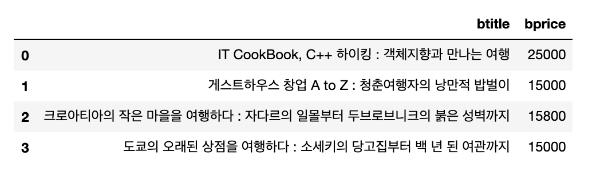
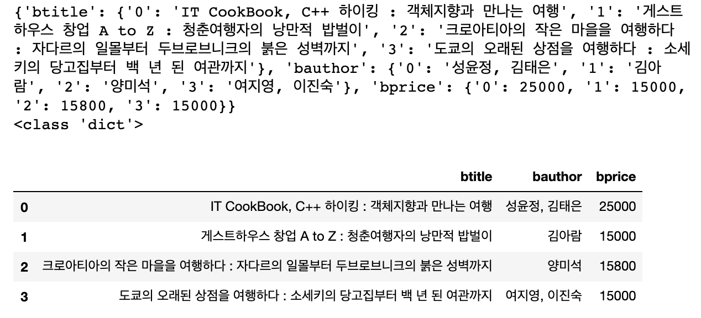

## Pandas - 2

Pandas - 1에서는 전반적인 Pandas의 활용에 대하여 알아보았습니다. 이번시간에는 본격적으로 좀더 자세하게 알아보도록 하겠습니다.

Database안에 Table을 사용하는 방법이 크게 2가지가 있습니다. 

1. Django에서 사용했던 ORM방식 ( Model 을 이용해서 Table을 사용하는 방법)
    => SQL이라고 불리는 Database 언어를 몰라도 Table을 사용할 수 있습니다.
2. 일반적으로 SQL 구문을 이용해서 Database안의 Table을 사용합니다.
    => SQL 구문을 알아야 table에서 내가 원하는 데이터를 추출할 수 있습니다.

그렇다면 간단하게 SQL 구문을 알아보도록 하겠습니다.

### SQL 문법

``` python
import pymysql.cursors
import pandas as pd

# pymysql이라는 module을 이용해서 데이터 베이스에 연결

conn = pymysql.connect(host= 'localhost',
                      user = 'data',
                      password = 'data',
                      db='library',
                      charset='utf8')

# 데이터베이스에 접속되면 SQL문을 실행시켜서 Database로 부터
# 데이터를 가져온 후 DataFrame으로 생성
# sql은 대소문자를 구분하지 않음
# WHERE 조건

# sql = 'SELECT btitle, bprice FROM book WHERE bprice >30000'

# 책 제목에 특정 키워드가 들어가 있는 책들만 골라오고 싶어요! (패턴매칭)
# sql = 'SELECT btitle, bprice FROM book WHERE btitle like "%java%"'
sql = 'SELECT btitle, bprice FROM book WHERE btitle  "%여행%"'

df = pd.read_sql(sql, con = conn)
display(df)
```

<p align = 'center'></p>


### JSON FILE 로 저장하기

Database나 CSV파일로부터 데이터를 읽어들여서 DataFrame으로 만들어 보았습니다. 이렇게 만든 DataFrame을 JSON으로 저장할 수 있습니다. JSON 파일로 저장할 때 <u>4가지</u> 방식이 있어요!! Database안의 book table에서 원하는 내용의 데이터를 가져온 후 DataFrame으로 만들어서  JSON 파일로 저장해 보겠습니다.

``` python
import pymysql.cursors
import pandas as pd

conn = pymysql.connect(host= 'localhost',
                      user = 'data',
                      password = 'data',
                      db='library',
                      charset='utf8')

sql = 'SELECT btitle,bauthor, bprice FROM book WHERE btitle like "%여행%"'

df = pd.read_sql(sql, con = conn)

display(df)

# DataFrame을 json파일로 저장할 때 총 4가지 서로 다른 형식이 존재.
# Unicode로 파일을 생성한 후 데이터를 저장해야 한글이 정상 처리가 되요!
# 파일을 저장할 폴더는 미리 생성이 되어 있어야 합니다.!!

# with : 일반적으로 파일 처리할 때 순서는 파일열기 - 내용쓰기 - 파일닫기 이순서...
#        with 구문을 이용하면 resource의 close처리(해제처리)가 자동으로 이루어져요!
with open('./data/json/books_columns.json', 'w', encoding='utf8') as file:
    df.to_json(file, force_ascii=False, orient = 'columns')
    # orient = columns로 설정하면 df의 column이 json의 key값으로 들어가요.
    
with open('./data/json/books_records.json', 'w', encoding='utf8') as file:
    df.to_json(file, force_ascii=False, orient = 'records')
    # orient = records로 설정하면 df의 각각의 record들의 첫번째 행이 json의 key값으로 들어가고 
    # dictionary 형태가 리스트 로 감싸져서 나타납니다.
    
with open('./data/json/books_index.json', 'w', encoding='utf8') as file:
    df.to_json(file, force_ascii=False, orient = 'index')
    # orient = index로 설정하면 df의 index이 json의 key값으로 들어갑니다.
    
with open('./data/json/books_values.json', 'w', encoding='utf8') as file:
    df.to_json(file, force_ascii=False, orient = 'values')
    # orient = values로 설정하면 df의 value값이 리스트형태로 저장됩니다.
```

### JSON FILE 불러오기

데이터베이스나 CSV파일을 통해 받은 데이터를 Json파일로 저장하는 것까지 해보았습니다. 이번에는 저장된 JSON파일을 불러와서 DataFrame을 생성해보겠습니다. 

```python
# JSON 파일을 읽어서 DataFrame을 생성해 보아요!!
import numpy as np
import pandas as np
import json

# 우리가 가지고 있는 json 파일을 open 해서 json내용을 읽어 들어야 해요!
with open('./data/json/books_columns.json', 'r', encoding ='utf-8') as file:
    dict_books = json.load(file) # json 데이터를 python의 dictionary로 저장
print(dict_books)
print(type(dict_books)) #<class 'dict'>
df = pd.DataFrame(dict_books)
display(df)
```

<p align ='center'></p>

