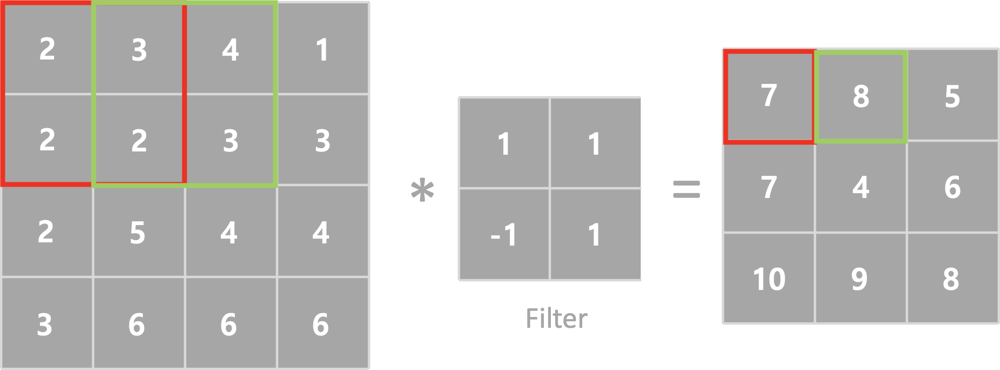
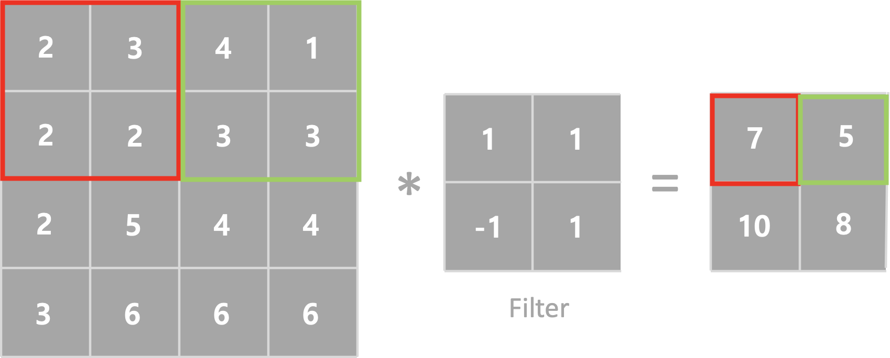

## CNN (Convolutional Neural Network)

이번시간에는 `CNN`에 대하여 알아보겠습니다. CNN 은 합성곱 신경망으로서 이미지의 특징을 검출하여 학습하는 방법입니다. DNN의 경우 MNIST에서 이미지를 판단할때 회전된 이미지의 대한 학습이 없다면 다른 이미지로 판단할 수 있습니다. 하지만 CNN 의 경우 이미지의 특징을 검출하기 시간과 효율이 좋습니다. 

하기 이미지를 보면서 설명을 해보도록하겠습니다.

*Image credits : [Mathworks](https://kr.mathworks.com/?s_tid=gn_logo)*

*Image credits : [Mathworks](https://kr.mathworks.com/?s_tid=gn_logo)*

CNN 은 Feature에 대한 학습을 먼저 진행하고 분류를 실행합니다. 특징을 학습하기 위해서 Filter 와 Convolution(합성곱)을 진행하게 됩니다. 

### Convolution (합성곱)

이미지를 입력하면 Filter와 합성곱을 통해서 새로운 이미지를 만들어 낼 수 있습니다. 

필터는 한개만 존재하지 않고 여러개가 존재할 수 있습니다. 따라서 이미지 하나에서 여러개의 Filter와 Convolution을 진행하면 Filter의 개수만큼 출력이미지를 얻을 수 있습니다.

### Strides 

Strides는 필터가 계산과정에서 이동하는 크기입니다. 기본값은 (1,1) 이며 (2,2), (3,3) 등으로 설정할수 있습니다. 하기 그림은 Strides 변환에 따른 출력이미지입니다. 

Strides = 1

Strides = 2

### Padding

위에서 확인한바와 같이 필터와 합성곱을 진행하면 출력이미지의 크기가 작아지게 됩니다. 이를 보상하기 위하여 나온 개념이 Padding 입니다. 입력데이터 가장자리에 빈 값을 채워넣어 행렬곱을 연산하는 방식이 Padding 이라고 부르며 가장자리 값이 모두 0으로 채워진 경우 Zero padding 이라고 부릅니다.

Padding 에는 두가지 방식이 존재합니다.

>**VALID**
>
>원본이미지에 비해 출력이미지가 작아지는 것을 허용합니다. 빈값을 채워넣지 않고 합성곱을 합니다.
>
>**Same**
>
>빈값을 넣어 원본이미지와 출력이미지가 동일한 크기가 되도록 빈값을 사용합니다.

