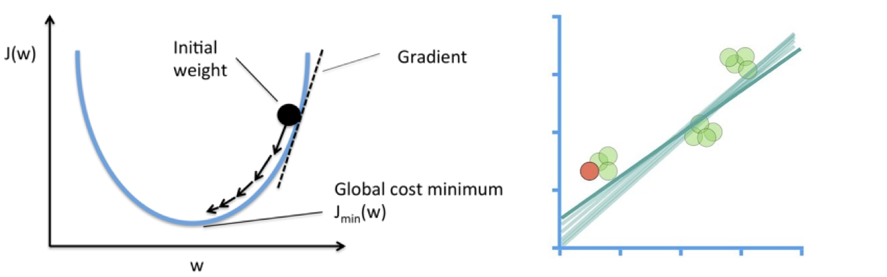
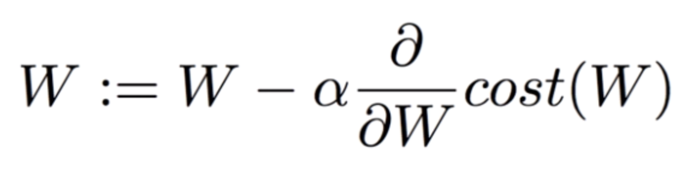
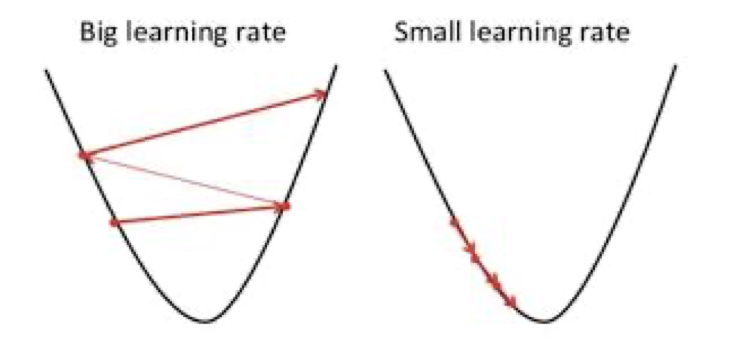
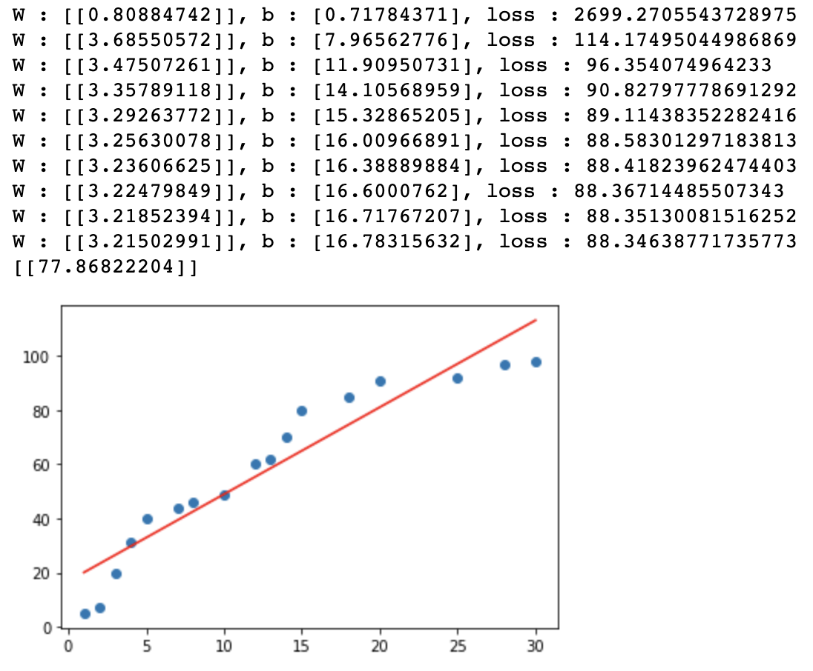

##  Linear Regression Model

Linear Regression을 함수로 표현하기전에 경사하강법에 대하여 알아보도록 하겠습니다.

학습데이터를 관통하는 하나의 직선이 존재한다는 Hypothesis를 만들어 낼 수 있으며 그 식은 `H(x) = Wx +b`라고 표현하였습니다. 그렇다면 최적의 Hypothesis를 만들기 위해서는 loss function 혹은 cost function 의  최소값을 구해야합니다.하지만 이것을 구하기 쉽지 않기때문에 우리는 경사하강법을 이용하여 최소값에 근사한 값을 구해보도록 하겠습니다.

#### 경사하강법

아래 그림대로 손실함수 그래프를 따라가면서 손실함수가 최소가 되는 지점에서의 W를 구하는 것입니다. W가 변화하면서 Hypothesis는 오른쪽 아래의 그림처럼 변화하게 됩니다.

<p align ='center'></p>

이것을 수식으로 표현하면 하기와 같습니다.

<p align='center'></p>

경사하강법의 다음 도착점은 W와 α(Learning rate) 그리고 손실함수의 미분값곱의 차로 결정됩니다. 여기서 Learning rate 값이 너무 크거나 작으면 하기 그림과 같은 상황이 벌어지게 됩니다.

<p align='center'></p>

그렇기 때문에 적절한 α을 찾아서 배정해주는 것이 중요합니다.

그렇다면 이번에는 코드로서 표현을 해보도록 하겠습니다. 학습데이터는 이전시간에 사용하였던 공부시간과 시험점수에 대한 데이터를 동일하게 사용하도록 하겠습니다.

코드를 구현하는 절차는 하기와 같습니다.

>1. Training Data Set을 준비
>     머신러닝에 입력으로 사용될 데이터를 NumPy array(ndarray)형태로 준비합니다.
>
>2. Linear Regression Model을 정의
>     y = Wx + b => model을 프로그램적으로 표현합니다. W 와 b에 대한 변수 선언한 후 초기값은 랜덤값을 이용합니다.
>
>3. loss function을 정의
>
>       손실함수(loss function)에 대한 코드를 작성 후 matrix처리해야해요
>
>4. learning rate의 정의
>
>       일반적으로 customizing이 되는 값으로 초기에는 0.001정도로 설정해서 사용하고 loss값을 보고 수치를 조절할 필요가 있습니다.
>
>5. 학습을 진행
>
>       반복적으로 편미분을 이용해서 W와 b를 update하는 방식으로 구현

``` python
import numpy as np
import matplotlib.pyplot as plt

data = {'공부시간(x)' : [1,2,3,4,5,7,8,10,12,13,14,15,18,20,25,28,30],
       '시험점수(t)':[5,7,20,31,40,44,46,49,60,62,70,80,85,91,92,97,98]}
x_data = np.array([1,2,3,4,5,7,8,10,12,13,14,15,18,20,25,28,30]).reshape(-1,1)
t_data = np.array([5,7,20,31,40,44,46,49,60,62,70,80,85,91,92,97,98]).reshape(-1,1)

#데이터의 분포를 scatter로 확인

# plt.scatter(x_data.ravel(), y_data.ravel()) # ravel() 무조건 1차원으로 변경
# plt.show()

# Linear Regression Model을 정의
# y = Wx+b
W = np.random.rand(1,1) # matrix
b = np.random.rand(1)   # scalar

# H = W*x + b # y대신에 Hypothesis 를 나타내는 H를 변수명으로 썼어요!

# loss function 
def loss_func(x,t):
    y = np.dot(x,W)+b 
    
    return np.mean(np.power((t-y),2)) # (t-y)^2/n

# 미분함수 (중앙차분)
def numerical_derivative(f, x):
    delta_x = 1e-4
    derivative_x = np.zeros_like(x)
    
    it = np.nditer(x, flags=['multi_index'])
    
    while not it.finished:
        idx = it.multi_index
        
        tmp = x[idx]
        
        x[idx]= tmp + delta_x
        fx_plus_delta = f(x)
        
        x[idx]= tmp - delta_x
        fx_minus_delta = f(x)
        
        derivative_x[idx] = (fx_plus_delta - fx_minus_delta) / (2 * delta_x)
        
        x[idx] = tmp
        
        it.iternext()
        
    return derivative_x

# prediction
def predict(x):
    return np.dot(x,W)+b # Hypthesis, Linear Regression Model

# learning rate라는 상수가 필요, 정의해야해요!
learning_rate = 0.0001

# 미분을 진행할 loss_func에 대한 lambda 함수를 정의
f = lambda x: loss_func(x_data, t_data)

# 학습을 진행!!
# 반복해서 학습을 진행 ( W 와 b를 update하면서 반복적으로 학습을 진행)
for step in range(90000):
    W = W -learning_rate * numerical_derivative(f, W) # W의 편미분
    b = b -learning_rate * numerical_derivative(f, b) # W의 편미분
    
    if step % 3000 == 0:
        print('W : {}, b : {}, loss : {}'.format(W,b,loss_func(x_data, t_data)))

# 학습 종료 후

print(predict(19))

plt.scatter(x_data.ravel(), t_data.ravel())

plt.plot(x_data.ravel(), np.dot(x_data,W)+b, 'r')
plt.show()
```

<p align='center'></p>

