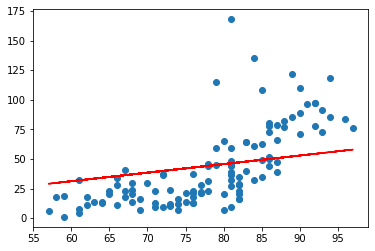
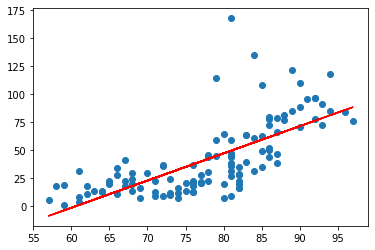
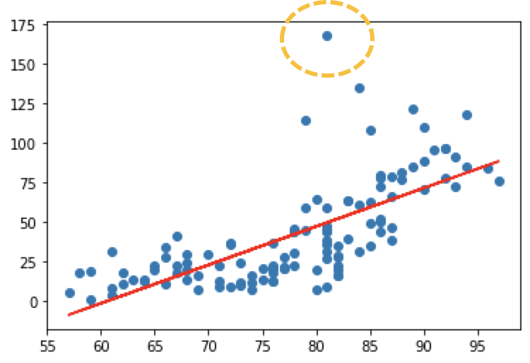
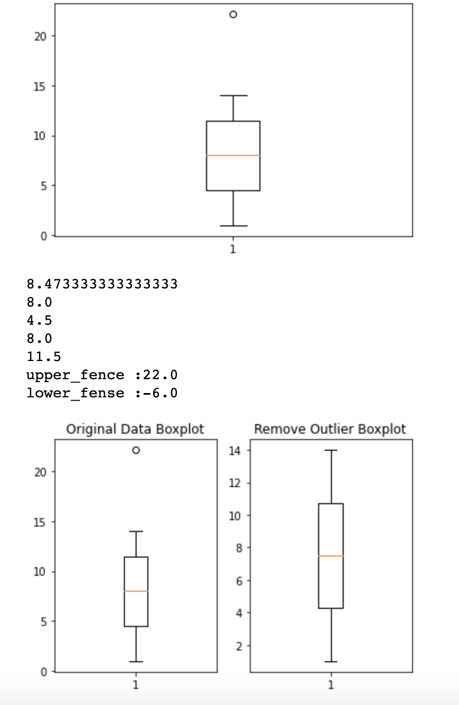
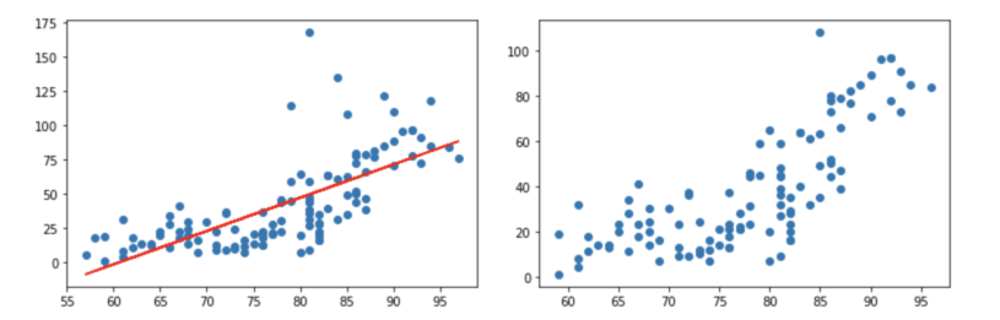
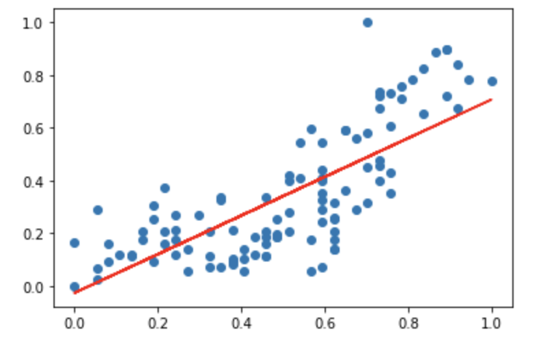

## Simple Linear Regression

이번 시간에는 실제 예제를 가지고 Linear Regression을 이용하여 예측 값을 산출해보도록 하겠습니다.

예제는 하기표처럼 온도와 오존량에 대한 데이터를 Training data로 사용할 예정이며 파일은 추가적으로 제공하도록 하겠습니다.

|      | Ozone | Solar.R | Wind | Temp | Month |  Day |
| ---: | ----: | ------: | ---: | ---: | ----: | ---: |
|    0 |  41.0 |   190.0 |  7.4 |   67 |     5 |    1 |
|    1 |  36.0 |   118.0 |  8.0 |   72 |     5 |    2 |
|    2 |  12.0 |   149.0 | 12.6 |   74 |     5 |    3 |
|    3 |  18.0 |   313.0 | 11.5 |   62 |     5 |    4 |
|    4 |   NaN |     NaN | 14.3 |   56 |     5 |    5 |
|  ... |   ... |     ... |  ... |  ... |   ... |  ... |
|  148 |  30.0 |   193.0 |  6.9 |   70 |     9 |   26 |
|  149 |   NaN |   145.0 | 13.2 |   77 |     9 |   27 |
|  150 |  14.0 |   191.0 | 14.3 |   75 |     9 |   28 |
|  151 |  18.0 |   131.0 |  8.0 |   76 |     9 |   29 |
|  152 |  20.0 |   223.0 | 11.5 |   68 |     9 |   30 |

저번시간과 똑같은 절차로 예측모델을 만들어 보도록 하겠습니다.

>1. Raw Data Loading
>2. Data Preprocessing ( 데이터 전처리 )
>3. Training Data Set
>4. 초기 W, b 세팅
>5. Loss function 정의
>6. 학습 예측 함수생성
>7. 기타 프로그램에사 필요한 변수 정의
>8. 학습진행
>9. 예측값 확인

``` python
import numpy as np
import pandas as pd
import matplotlib.pyplot as plt
from data.my_library.machine_learning_library import numerical_derivative as nd

# 1. Raw Data Loading
df = pd.read_csv('./data/ozone.csv')
# display(df)

# 2. Data Preprocessing(데이터 전처리)
# - 결측치 처리...
# - 삭제, 값을 변경(평균, 최대, 최소), 값을 예측해서 값을 대체 
# - 이상치 처리(outlier)
# - 이상치를 검출하고, 변경하는 작업
# - 데이터 정규화 작업
# - 학습에 필요한 컬럼을 추출, 새로 생성.


# 필요한 column 만 추출
# 결치값을 제거!!


training_data = df[['Temp','Ozone', ]]
# display(training_data)
# print(training_data.shape) #(153, 2)


training_data = training_data.dropna(how='any')
# display(training_data)
# print(training_data.shape) #(116, 2)

# 3. Training Data Set
x_data = training_data['Temp'].values.reshape(-1,1)
t_data = training_data['Ozone'].values.reshape(-1,1)

# 4. Simple Linear Regression
#    y = Wx + b //  W,b를 정의
W = np.random.rand(1,1)
b = np.random.rand(1)

# 5. loss function 정의
def loss_func(x, t):
    y = np.dot(x, W) + b
    return np.mean(np.power(t-y,2)) # 최소제곱법

# 6. 학습종료 후 예측함수
def predict(x):
    return np.dot(x,W) +b

# 7. 기타 프로그램에서 필요한 변수들을 정의
learning_rate = 1e-4

f = lambda x: loss_func(x_data, t_data)

# 8. 학습을 진행
for step in range(30000):
    W -= learning_rate * nd(f, W)
    b -= learning_rate * nd(f, b)
    
    if step %3000 ==0:
        print ('W : {}, b : {}, loss : {}'.format(W, b, loss_func(x_data,t_data)))
    
# 9. 그래프로 확인
plt.scatter(x_data, t_data)
plt.plot(x_data, np.dot(x_data, W)+b, 'r')
plt.show()

print(predict(62))
```

```
W : [[0.48898185]], b : [0.1382576], loss : 903.6007199549715
W : [[0.58275697]], b : [-1.13623806], loss : 861.0875644794504
W : [[0.59874403]], b : [-2.39947113], loss : 855.7685424676351
W : [[0.61459263]], b : [-3.65176381], loss : 850.5412536613877
W : [[0.63030397]], b : [-4.89321085], loss : 845.4041160065931
W : [[0.64587924]], b : [-6.12390617], loss : 840.3555747335402
W : [[0.66131962]], b : [-7.34394289], loss : 835.3941018864972
W : [[0.67662628]], b : [-8.55341332], loss : 830.518195861303
W : [[0.69180037]], b : [-9.75240898], loss : 825.7263809507612
W : [[0.70684304]], b : [-10.94102059], loss : 821.0172068981508
```

<p align='center'></p>

### Scikit-learn

앞선 코드를 통하여 상기의 그래프를 얻었습니다. 육안으로 판단을 해보았을때 y 절편인 b 값이 좀더 내려오고 기울기값인 W 가 높은 값을 가져야만 할 것 같은데요. 물론 그래프의 조정이나 learning_rate를 조정하면서 원하는 결과치를 얻을 수 있겠지만 이번시간에는 `Scikit-learn`을 통해서 좀더 쉽게 최적의 그래프를 얻어보도록 하겠습니다. 코드를 통해서 알아보도록 하겠습니다.

```python
import numpy as np
import pandas as pd
import matplotlib.pyplot as plt 
from sklearn import linear_model

# 1. Raw Data Loading
df = pd.read_csv('./data/ozone.csv')
# display(df)

# 2. Data Preprocessing(데이터 전처리)
# - 결측치 처리...
# - 삭제, 값을 변경(평균, 최대, 최소), 값을 예측해서 값을 대체 
# - 이상치 처리(outlier)
# - 이상치를 검출하고, 변경하는 작업
# - 데이터 정규화 작업
# - 학습에 필요한 컬럼을 추출, 새로 생성.


# 필요한 column 만 추출
# 결치값을 제거!!
#

training_data = df[['Temp','Ozone', ]]


training_data = training_data.dropna(how='any')
# display(training_data)
# print(training_data.shape) #(116, 2)

# 3. Training Data Set
x_data = training_data['Temp'].values.reshape(-1,1)
t_data = training_data['Ozone'].values.reshape(-1,1)

# 4. sklearn을 이용해서 linear regression model 객체를 생성
# 아직 완성되지않은( 학습되지 않은 모델을 일단생성)
model = linear_model.LinearRegression()

# 5. Training Data Set을 이용해서 학습을 진행!
model.fit(x_data, t_data)

# 6. W와 b 값을 알아내야 해요!
print('W:{}, b:{}'.format(model.coef_, model.intercept_)) 
# W:[[2.4287033]], b:[-146.99549097]


# 7. 그래프로 확인해보아요!
plt.scatter(x_data, t_data)
plt.plot(x_data, np.dot(x_data, model.coef_)+model.intercept_, 'r')
plt.show() 

# 8. 예측을 한번 해보아요!!
predict_val = model.predict([[62]])
print(predict_val) #[[3.58411393]]
```

<p align='center'></p>

`Scikit-learn`을 통해서 좀더 쉽게 최적의 그래프를 얻을 수 있었습니다. 그렇다면 왜 이런현상이 발생하는 것일까요?? 바로 데이터의 전처리가 잘안되서 발생하는 문제입니다.

<p align='center'></p>

그래프를 보면 노란색으로 표시된 부분의 데이터가 비정상적으로 튀는 것을 확인할 수 있습니다.

### 이상치 처리(Outlier)

비정상적인 데이터를 처리하는 방법에는 두 가지가 있습니다. 

1. Tukey Outlier(4분위값을 이용하는 이상치 검출방식)
2. Z-Score (분산, 표준편차를 이용하는 이상치 검출방식 - 통계기반)

이상치(Outlier)는 속성의 값이 일반적인 값보다 편차가 큰 값을 의미합니다. 즉, 데이터 전체 패턴에서 동떨어져 있는 관측치를 지칭해요. 평균 뿐아니라 분산에도 영향을 미치기 떄문에 결국은 데이터 전체의 안정성을 저해하는 요소입니다. 그래서 이상치는 반드시 처리해야 하고 이것을 검출하고 처리하는데 상당히 많은 시간이 소요되는게 일반적입니다.독립변수(온도)에 있는 이상치를 지대점이라고 하고 종속변수(오존량)에 있는 이상치를 outlier라고 합니다.

#### Turkey Outlier

그러면 첫번째로 `Tukey outlier`를 이용해서 처리해보겠습니다. 4분위값을 이용해서 outlier를 감지할 수 있어요.
4분위 그래프는 boxplot이라는걸 이용해서 확인할 수 있습니다. Boxplot을 사용할 떄 이상치를 분류하는 기준은 `IQR value`를 사용합니다. 

<p align='center'></p>
IQR value = 3사분위값 - 1사분위값

1사분위수 -1.5 *IQR value이 값보다 작은 값은 이상치로 판별

3사분위수 +1.5 * IQR value이 값보다 더 큰 값은 이상치로 판별

``` python
import numpy as np
import matplotlib.pyplot as plt
data = np.array([1,2,3,4,5,6,7,8,9,10,11,12,13,14,22.1])

plt.boxplot(data)
plt.show()

fig = plt.figure() # 새로운 그림(figure)을 생성

fig_1 = fig.add_subplot(1,2,1) # 1행 2열의 subplot의 위치가 1번 위치
fig_2 = fig.add_subplot(1,2,2) # 1행 2열의 subplot의 위치가 2번 위치
fig_1.set_title('Original Data Boxplot')
fig_1.boxplot(data)

# numpy로 사분위수를 구하려면 percentile() 함수를 이용해요!
print(np.mean(data)) # 평균
print(np.median(data)) # 중위수, 2사분위, 미디언
print(np.percentile(data,25)) # 1사분위
print(np.percentile(data,50)) # 2사분위
print(np.percentile(data,75)) # 3사분위

# 이상치를 검출하려면 IQR value가 필요
IQR_val = np.percentile(data,75) - np.percentile(data,25)

upper_fense = np.percentile(data,75) + 1.5*IQR_val
lower_fense = np.percentile(data,25) - 1.5*IQR_val

print ('upper_fence :{}'.format(upper_fense))
print ('lower_fense :{}'.format(lower_fense))

# 데이터 중에 이상치를 출력하고
# 이상치를 제거한 데이터로 boxplot을 그려보세요!!

result_data = data[(data <= upper_fense)&(data >= lower_fense)]
fig_2.set_title('Remove Outlier Boxplot')
fig_2.boxplot(result_data)

plt.show()
```

<p align='center'></p>

#### Z-Score

Z-Score에서는 좀더 쉽게 이상치를 제거할 수 있습니다. 임계값을 설정하고 정규분포에 의해 이상치를 분류하거나 제외할 수 있습니다. 

```python
from scipy import stats
data = np.array([1,2,3,4,5,6,7,8,9,10,11,12,13,14,22.1])

zscore_threshold = 1.8 # zscore outlier 임계값 ( 일반적 2)
stats.zscore(data)

outliers = data[np.abs(stats.zscore(data))>zscore_threshold]
print(outliers) #[22.1]
print(data[np.isin(data,outliers, invert = True)])
#[ 1.  2.  3.  4.  5.  6.  7.  8.  9. 10. 11. 12. 13. 14.]
```


이상치를 전부 제거했다면 제거된 이상치를 바탕으로 학습을 시켜 예측을 해보면 좀더 정확한 값을 얻을 수 있습니다. 하기예제를 보며서 이상치를 제거한 산포도와 그렇지 않은 산포도를 비교하면서 보도록 하겠습니다.

```python
# 필요한 모듈 module import
import numpy as np
import pandas as pd
from data.machine_learning_library import numerical_derivative
import matplotlib.pyplot as plt
from scipy import stats

# Raw Data Loading
df = pd.read_csv('./data/ozone.csv')
display(df)
training_data = df[['Temp','Ozone']]
training_data = training_data.dropna(how='any')
print(training_data.shape)

zscore_theshold = 2.0
# outlier를 출력
# Temp에 대한 이상치(지대점)를 확인
outliers = training_data['Temp'][np.abs(stats.zscore(training_data['Temp']))>zscore_theshold]
training_data = training_data.loc[~training_data['Temp'].isin(outliers)]
display(training_data.shape)


outliers = training_data['Ozone'][np.abs(stats.zscore(training_data['Ozone']))>zscore_theshold]
training_data = training_data.loc[~training_data['Ozone'].isin(outliers)]
display(training_data.shape)
display(training_data)


# Training Data Set
x_data = training_data['Temp'].values.reshape(-1,1)
t_data = training_data['Ozone'].values.reshape(-1,1)

# Weight & bias
W = np.random.rand(1,1)
b = np.random.rand(1)

# loss function 
def loss_func(x, t):
    y = np.dot(x, W)+b
    return np.mean(np.power(t-y,2))

def predict(x):
    return np.dot(x,W)+b

learning_rate = 1e-5

f = lambda x: loss_func(x_data, t_data)

for step in range(30000):
    W -= learning_rate * numerical_derivative(f, W)
    b -= learning_rate * numerical_derivative(f, b)
    
    if step % 3000 == 0:
        print('W : {}, b : {}, loss : {}'.format(W,b,loss_func(x_data, t_data)))

plt.scatter(x_data, t_data)
plt.plot(x_data, np.dot(x_data, W)+b, 'r')
plt.show()
```

 <p align='center'></p>

 이전 산포도(왼쪽 산포도)와 비교했을때 이상치가 많이 없어진 것을 확인할 수 있습니다. 


### 정규화 (Nomalization)

데이터가 가진 feature들의 scale이 심하게 차이나는 경우 조정해줘야합니다. 예를들어 집에 대한 데이터를 판별할때 방의개수와 집의 연식(월)의 경우 방의 개수는 보통 한자리수의 정수로 표현되는데 비해 집의 연식의 경우 최대 세자리 정수로도 표현이 가능합니다. 이렇게 최대 100배 이상의 scale 이 차이가 나는경우 각 feature들에 대해 동일한 scale을 적용할 필요가 있습니다. 이것을 `정규화 (Nomalization)`라고 부릅니다.

정규화에는 크게 2가지 방법으로 나뉩니다.

1. Min-Max Normalization (정규화)

   데이터를 정규화하는 가장 일반적인 방법입니다. 모든 feature들에 대해 최소값 (0) ~ 최대값 (1) Scaling(변환)을 하는 방법입니다.

   - 변환공식 = (Xi - X(min)) / (X(max) - X(min))

   - 장점 : 동일한 기준을 가지고 Scaling 가능
   - 단점 : 이상치를 처리를 안하면 상당히 민감하게 반응

2. Stadardization - Z-Score Normalization (표준화)

   평균과 분산을 이용한 Scaling방법 입니다.

   - 변환공식 = x (scale) = (xi - 평균) / 분산

   - 장점 : 이상치에 덜민감합니다.
   - 단점 : 동일한 척도로 scaling 되지않습니다.

그렇다면 상기에서 했던 예제를 다시사용하여 정규화까지 해보도록 하겠습니다.

``` python
# 필요한 Module import

# 필요한 모듈 module import
import numpy as np
import pandas as pd
from data.machine_learning_library import numerical_derivative
import matplotlib.pyplot as plt
from scipy import stats
from sklearn.preprocessing import MinMaxScaler

# Raw Data Loading
df = pd.read_csv('./data/ozone.csv')
# display(df)
training_data = df[['Temp','Ozone']]
training_data = training_data.dropna(how='any')
# print(training_data.shape)

zscore_theshold = 2.0
# outlier를 출력
# Temp에 대한 이상치(지대점)를 확인하고 제거 
outliers = training_data['Temp'][np.abs(stats.zscore(training_data['Temp']))>zscore_theshold]
training_data = training_data.loc[~training_data['Temp'].isin(outliers)]
# display(training_data.shape)


outliers = training_data['Ozone'][np.abs(stats.zscore(training_data['Ozone']))>zscore_theshold]
training_data = training_data.loc[~training_data['Ozone'].isin(outliers)]
# display(training_data.shape)

# 정규화 처리
# 직접구현해도 되지만 sklearn을 이용하세요!!

# 독립변수와 종속변수의 Scaler객체를 각각 생성
scaler_x = MinMaxScaler() # MinMaxScaler 클래스의 객체를 생성!
scaler_t = MinMaxScaler() 

scaler_x.fit(training_data['Temp'].values.reshape(-1,1))
scaler_t.fit(training_data['Ozone'].values.reshape(-1,1))

training_data['Temp'] = scaler_x.transform(training_data['Temp'].values.reshape(-1,1))
training_data['Ozone'] = scaler_t.transform(training_data['Ozone'].values.reshape(-1,1))

# Training Data Set
x_data = training_data['Temp'].values.reshape(-1,1)
t_data = training_data['Ozone'].values.reshape(-1,1)

# Weight & bias
W = np.random.rand(1,1)
b = np.random.rand(1)

# loss function 
def loss_func(x, t):
    y = np.dot(x, W)+b
    return np.mean(np.power(t-y,2))

def predict(x):
    return np.dot(x,W)+b

learning_rate = 1e-4

f = lambda x: loss_func(x_data, t_data)

for step in range(300000):
    W -= learning_rate * numerical_derivative(f, W)
    b -= learning_rate * numerical_derivative(f, b)
    
    if step % 30000 == 0:
        print('W : {}, b : {}, loss : {}'.format(W,b,loss_func(x_data, t_data)))

plt.scatter(x_data, t_data)
plt.plot(x_data, np.dot(x_data, W)+b, 'r')
plt.show()

print (predict(62)) #사이킷 런은 3.5  하지만 이번에 결과는 24....

predict_data = np.array([62])
scaled_predict_data = scaler_x.transform(predict_data.reshape(-1,1))


scaled_result = predict(scaled_predict_data)
result = scaler_t.inverse_transform(scaled_result)
print(result) #사이킷 런은 3.5 4.2
```

<p align='center'></p>

그래프의 x축과 y축을 보면 0 - 1사이로 Scale이 변경된 것을 확인할 수 있습니다.

