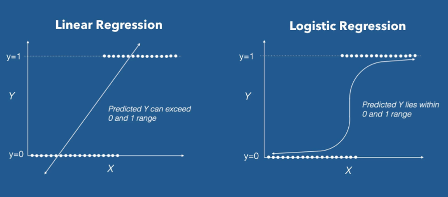

## Classfication

이번시간에는 Classification에 대하여 알아보도록 하겠습니다. Training Data Set 특성과 분포를 파악한 후 미지의 입력데이터에 대해 어떤 종류의 값으로 분류될 수 있는지 예측합니다. 학습 후 예측데이터의 결과를 0혹은 1사이의 실수로 판단하고 0.5이상의 확률을 가진 인자들을 Pass (1) 그 이하인 확률을 Fail (0)으로 판단하여 분류하는 것을 Classification이라고 합니다.

### Logistic Regression

이전까지 배웠던 Linear Regression과 더불어 Logistic Regression에 대하여 알아보도록 하겠습니다. Logistic Regression은 0에서 1사이의 값을 가지는 확률로 표현하기 위하여 사용됩니다.

<p align = 'center'></p>


### Sigmoid

먼저 구한 Linear Regression 모델에서 나온 값을 하기식에 대입하여 계산하면 0에서 1사이의 값을 추출할 수 있습니다.

<p align = 'center'></p>

### Classification - Cost(Loss) function

Sigmoid를 사용할 경우 Linear regression에서 사용하였던 Cost Function을 사용할 수 없습니다. 왜냐하면 Convex fuction 이 되지 않기 때문에 자칫 잘못하면 Local optima가 생길 수 있어 Global minimum을 찾을수 없기 때문입니다. 그렇기 때문에 Logistic Regression의 Cost function 은 하기와 같이 정의 됩니다.

Loss function =  -(t*log y + (1-t)log(1-y))


간단한 예시를 통해서 Logistic  Regression에 대하여 알아보도록 하겠습니다.

공부시간에 따른 시험합격여부에 대한 데이터를 Linear Regression으로 분석하고 합격여부를 알아보도록 하겠습니다.

``` python
import numpy as np
import matplotlib.pyplot as plt
from sklearn import linear_model

# Training Data Set
x_data = np.array([1,2,5,8,10,30]) # 공부시간
t_data = np.array([0,0,0,1,1,1]) # 시험합격여부(0:Fail, 1:Pass)

model = linear_model.LinearRegression()
model.fit(x_data.reshape(-1,1),
         t_data.reshape(-1,1))
print(model.coef_, model.intercept_) # [[0.03500583]] [0.17327888]
model.coef_
plt.scatter(x_data, t_data)
plt.plot(x_data, x_data * model.coef_.ravel() + model.intercept_, 'r')
```

<p align='center'></p>

상기 그래프를 보면 실데이터에서는 8시간 이상 공부를 한다면 충분히 합격을 할 수 있지만 Linear Regression으로 분석을 한다면 24시간 정도를 공부를 해야 시험을 합격할 수 있습니다. 이러한 문제때문에 Classification을 하려고 할때에는 Logistic Regression을 사용한다고 보시면 되겠습니다. 

그렇다면 다른 데이터를 사용해서 한번 구해보도록 하겠습니다.

``` python
# 예측모델 
import tensorflow as tf
import numpy as np

# training data set
# 외국어 공부시간(시간), 해외체류기간(년)
x_data = np.array([[1,0],
                 [2,0],
                 [5,1],
                 [2,3],
                 [3,3],
                 [8,1],
                 [10,0]])


# 시험합격여부(0:Fail, 1:Pass)
t_data = np.array([[0],
                  [0],
                  [0],
                  [1],
                  [1],
                  [1],
                  [1]])
# placeholder
X = tf.placeholder(shape=[None,2], dtype = tf.float32)
T = tf.placeholder(shape=[None,1], dtype = tf.float32)

# Weight & bias
W = tf.Variable(tf.random.normal([2,1]), name = 'weight')
b = tf.Variable(tf.random.normal([1]), name = 'bias')

# Hypothesis(Logistic Model)
logit = tf.matmul(X,W) + b # Linear Regression Hypothesis
H = tf.sigmoid(logit)

# loss function 
loss = tf.reduce_mean(tf.nn.sigmoid_cross_entropy_with_logits(logits = logit, labels=T))


## 8. Training 노드생성
train = tf.train.GradientDescentOptimizer(learning_rate=0.001).minimize(loss)

# Session & 초기화
sess = tf.Session()
sess.run(tf.global_variables_initializer())

# 10. 학습을 진행(Graph를 실행)
for step in range(3000):
    _, W_val,b_val, loss_val = sess.run([train, W,b, loss], feed_dict={X:x_data, T:t_data}) 
    # train = _ / W = W_val / b = b_val / loss = loss_val
    
    if step%300 ==0:
        print ('W:{}, b:{}, loss:{}'.format(W_val,b_val,loss_val))


# 11. 내가 알고싶은 값을 넣어서 predict!!
# predict_data_x = np.array([[150,8,85]])
# predict_data_x = scaler_x.transform(predict_data_x)
result = sess.run(H, feed_dict={X:[[4,2]]})

# result = scaler_t.inverse_transform(result)

print(result)

'''
W:[[-0.09505238]
 [-0.28877407]], b:[0.5809646], loss:0.9031272530555725
W:[[ 0.07203682]
 [-0.16718708]], b:[0.57360214], loss:0.7202726006507874
W:[[ 0.09072737]
 [-0.08331408]], b:[0.54003835], loss:0.6912368535995483
W:[[ 0.08967677]
 [-0.01323891]], b:[0.5013897], loss:0.6698331832885742
W:[[0.08644719]
 [0.04807308]], b:[0.46102154], loss:0.6518125534057617
W:[[0.08408184]
 [0.10256049]], b:[0.41977572], loss:0.6362107396125793
W:[[0.08290234]
 [0.15140326]], b:[0.37797752], loss:0.6224187016487122
W:[[0.082752  ]
 [0.19549072]], b:[0.33582368], loss:0.6100078225135803
W:[[0.0834328 ]
 [0.23553707]], b:[0.29346314], loss:0.5986728668212891
W:[[0.0847775]
 [0.2721263]], b:[0.25101608], loss:0.5881935954093933
[[0.7625255]]
'''
```

