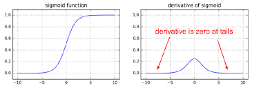
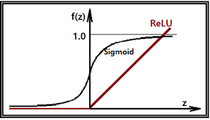

## Relu 

우리는 이번시간까지 classification을 사용할때 sigmoid 함수를 사용하였습니다. 오늘은 sigmoid의 한계점과 `Relu`에 대하여 알아보도록 하겠습니다.

### backpropagation (1986)

Hidden layer의 개수가 많아지면 많아질수록 학습이 제대로 이뤄질 것이라고 생각하나 그렇지않습니다. weight 와 bias를 갱신할때 loss값을 확인하고 갱신을 하게 됩니다. 즉 output의 결과를 바탕으로 다시 역순으로 weight와 bias를 갱신합니다. 

### Vanishing Gradient

sigmoid의 경우에 0과 1사이의 값을 가지고 있어 결국 layer 많아지는 경우 그 값이 0에 수렴하게 됩니다. 미분값이 결국에는 0으로 수렴하게 되어 경사가 사라지는 현상이 발생하는데 이를 `Vanishing Gradient`이라고 부릅니다. 즉 다음 layer로 전파가 되지않는 현상이 발생하게 되며 학습이 되지 않습니다.

<p align='center'></p>{: .shadow}


### Relu (Rectified Linear Unit)

이러한 한계를 극복하기 위해 Relu함수가 등장하게 되었습니다. 하기의 그래프는 보면 sigmoid 와 달리 결과 값이 0 ~ 1 과의 값으로 표현되지 않습니다.

<p align ='center'></p>


```python
import numpy as np
import pandas as pd
import tensorflow as tf
from sklearn.preprocessing import MinMaxScaler # Normalization
from sklearn.model_selection import train_test_split # train, test 데이터분리
from sklearn.model_selection import KFold # cross validation
from tensorflow.keras.models import Sequential
from tensorflow.keras.layers import Flatten, Dense
from tensorflow.keras.optimizers import SGD

df = pd.read_csv('/Users/admin/Downloads/Digit_Recognizer_train.csv')

display(df)
# 결측치 확인
print(df.isnull().sum())
x_data = df.iloc[:,1:]
t_data = df['label']

# Data split
x_data_train, x_data_test, t_data_train, t_data_test=\
train_test_split(x_data,t_data,test_size = 0.3, random_state = 0)

# 데이터 정규화 (Normalization)
x_scaler = MinMaxScaler()
x_scaler.fit(x_data_train)
x_data_train_norm = x_scaler.transform(x_data_train)
x_data_test_norm = x_scaler.transform(x_data_test)

sess = tf.Session()   # Tensorflow node를 실행하기 위해서 session을 생성

# depth는 label의 종류 개수
t_data_train_onehot = sess.run(tf.one_hot(t_data_train, depth=10))  
t_data_test_onehot = sess.run(tf.one_hot(t_data_test, depth=10))


# Placeholder
X = tf.placeholder(shape = [None, 784], dtype = tf.float32)
T = tf.placeholder(shape = [None, 10], dtype = tf.float32)

#### 여기서부터 달라져요

# Weight & bias
# 
W2 = tf.get_variable('weight2',shape=[784,256],
                     initializer = tf.contrib.layers.variance_scaling_initializer())
b2 = tf.Variable(tf.random.normal([256]), name='bias2')
layer2 = tf.nn.relu(tf.matmul(X, W2) + b2)


W3 = tf.get_variable('weight3',shape=[256,128], 
                     initializer = tf.contrib.layers.variance_scaling_initializer())
b3 = tf.Variable(tf.random.normal([128]), name='bias3')
layer3 = tf.nn.relu(tf.matmul(layer2, W3) + b3)

W4 = tf.get_variable('weight4',shape=[128,10], 
                     initializer = tf.contrib.layers.variance_scaling_initializer())
b4 = tf.Variable(tf.random.normal([10]), name='bias4')

# Hypothesis
logit = tf.matmul(layer3, W4) + b4
H = tf.nn.softmax(logit)     # Multinomial Hypothesis

# Loss
loss = tf.reduce_mean(tf.nn.softmax_cross_entropy_with_logits_v2(logits=logit,
                                                                 labels=T))

train = tf.train.GradientDescentOptimizer(learning_rate=1e-1).minimize(loss)


num_of_epoch = 100
batch_size = 100

# 7. 학습진행
def run_train(sess,train_x, train_t):
    print('### 학습 시작 ###')
    sess.run(tf.global_variables_initializer())  # tf.Variable 초기화(W,b)

    total_batch = int(train_x.shape[0] / batch_size)
    for step in range(num_of_epoch):

        for i in range(total_batch):
            batch_x = train_x[i*batch_size:(i+1)*batch_size]
            batch_t = train_t[i*batch_size:(i+1)*batch_size]
            _, loss_val = sess.run([train,loss], feed_dict={X:batch_x,
                                                            T:batch_t})
        if step % 10 == 0:
            print('Loss : {}'.format(loss_val))
    print('### 학습 끝 ###')

    
    
# Accuracy
predict = tf.argmax(H,1)   # [[0.1 0.3  0.2 0.2 ... 0.1]]

# sklearn을 이용해서 classification_report를 출력해보아요!!

# train데이터로 학습하고 train데이터로 성능평가를 해 보아요!!  

run_train(sess,x_data_train_norm,t_data_train_onehot)

```

