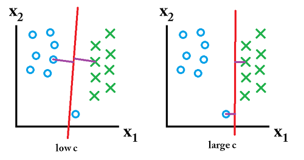

## SVM (Support vector machine)

`Support Vector machine`은 데이터를 선형으로 분리하여 최적의 decision boundary (결정경계)를 찾는 알고리즘입니다.

<p align = 'center'></p>

데이터를 기반으로 support Vectors를 찾아내고 그사이의 Margin이 최대화되는 Separatin Hyperplane을 찾아냅니다. 하지만 데이터의 이상치가 있는경우에는 이상치가 support vector가 되는 경우가 발생하여 overfitting이 될 수 있습니다. 즉 이상치 처리없이 모든데이터로 SVM을 사용하면 overfitting 이 발생하고 이를 Hardmargin이라고 부릅니다. 그 반대의 상황은 Softmargin이라고 부릅니다.

### Cost (C)

하지만 모든데이터를 선형으로 정확하게 구분을 할수는 없는데 이를 해결하기위해 나온개념이 Cost(C) 입니다. C는 다른 클래스에 얼마만큼의 데이터가 들어갈지를 정합니다. C가 커지면 정확하게 선형을 구분하기위해서 overfitting이 될수 있으며 C가 너무 작으면 underfitting 가능성이 있습니다.

<p align='center'></p>

### Kernel 기법

주어진 data를 고차원의 공간으로 투영(projection)하는 기법입니다. 기존차원에서 선형적으로 분류할 수 없는 데이터를 고차원에서 선형으로 분류할 수 있도록 하는 방법입니다. Kernel 기법에는 주로 3가지가 존재합니다.

> - **Linear**
> - **Poly**
> - **rbf**

여기서 많이 사용되며 성능이 가장 좋은 것은 rbf kernel 이며, 매개변수 gamma를 조절해야합니다.

### gamma

gamma는 데이터가 영향력을 행사하는 거리다. 결론부터 말하면 gamma가 작아지면 영향력이 커지며 underfitting이 발생하고 커지면 영향력이 작아져 overfitting 이 발생할 수 있다. gamma는 가우시안 함수의 표준편차와 관련되어 있으며 클수로 작은 표준편차를 가집니다. 

즉 , C와 gamma가 커지면 알고리즘의 복잡도가 증가합니다. (Overfitting) 

일반적으로 C와 gamma를 결정하기위해서 Grid search로 매개변수값을 찾아나가는데 sklearn에서 제공하는 코드를 통하여 최적의 매개변수를 찾아보도록 하겠습니다.

``` python
%reset
import numpy as np
import pandas as pd
import matplotlib.pyplot as plt
from sklearn.preprocessing import MinMaxScaler
from mlxtend.plotting import plot_decision_regions
from sklearn.svm import SVC
from sklearn.model_selection import GridSearchCV
from sklearn.metrics import classification_report

# training data set
df = pd.read_csv('./data/bmi.csv', skiprows =3)
display(df)

x_data = df.iloc[:,1:].values # 2차원 형태의 numpy
t_data = df.iloc[:,0].values

x_scaler = MinMaxScaler()
x_scaler.fit(x_data)
x_data = x_scaler.transform(x_data)


# matplotlib을 이용해서 t_data가 0인경우 red, 1인경우 blue, 2인경우 green으로 표현
# 총 2만개 중에 각각 30개씩만 뽑아서그래프를 그려보아요
num_sample = 30
df_0 = df[df['label'] ==0].head(num_sample)
plt.scatter(df_0.iloc[:,1], df_0.iloc[:,2], color = 'r')

df_1 = df[df['label'] ==1].head(num_sample)
plt.scatter(df_1.iloc[:,1], df_1.iloc[:,2], color = 'b')

df_2 = df[df['label'] ==2].head(num_sample)
plt.scatter(df_2.iloc[:,1], df_2.iloc[:,2], color = 'g')

# plt.show()
x_data_sample = np.concatenate((df_0.iloc[:,1:3],df_1.iloc[:,1:3],df_2.iloc[:,1:3]),axis = 0)
t_data_sample = np.concatenate((df_0.iloc[:,0],df_1.iloc[:,0],df_2.iloc[:,0]),axis = 0)

#sklearn 구현
model = SVC()

param = [
    {'kernel':['linear'],
    'C':[10,50,100,500,1000, 5000]},
    {'kernel': ['rbf'],
    'C': [1,5,10,50,100,500,1000,50000],
    'gamma': [0.01, 0.005, 0.1, 0.5, 1, 5, 10, 50]}
]

# 만약 CV =6 + 64 = 70

grid_search = GridSearchCV(model,
                          param,
                          cv=5,
                          scoring='accuracy',
                          verbose=2)
grid_search.fit(x_data_sample, t_data_sample)
```

