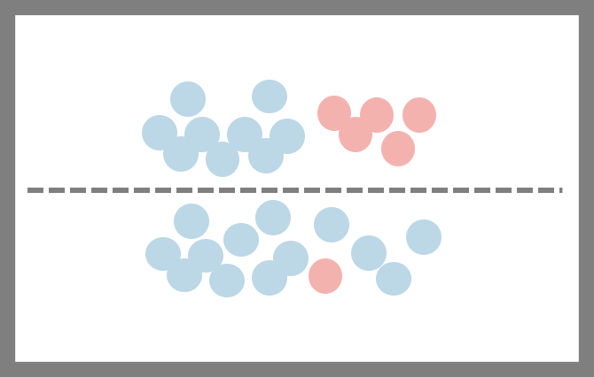

## Decision Tree

`Decision Tree` 는 Root Node를 시작으로 Decision Node를 기준으로 데이터를 분류하는 기법입니다. Decision Node에서 분류가 완료되면 Leaf Node에 도달하게되고 분류가 완료가 됩니다.

<p align='center'></p>

### 불순도 & 엔트로피

`불순도`는 분류된 데이터가 얼마만큼 섞여 있는지를 의미합니다. 하기그림을 보면 점선을 기준으로 위쪽은 두개의 데이터가 많이 섞여있고 아래에는 조금 섞여 있습니다. 불순도를 따지자면 위쪽이 불순도가 높고 아래가 불순도가 낮다고 표현합니다.

<p align ='center'></p>

`엔트로피` 란 불순도를 수치적으로 표현한 척도입니다. 


$$
Entropy = -\sum_{i=1}^{m} (p_{i})log_{2}(p_{i})
$$


불순도가 높으면 엔트로피는 1에 수렴하고 낮으면 0에 가까워 집니다.

상기 그림에서 엔트로피를 구해보도록 하겠습니다. 하늘색이 22개 빨간색이 6개이며 엔트로피를 구하면 하기 수식이 나옵니다.


$$
-[\frac{22}{22+6}(log_{2}(\frac{22}{22+6})] -[\frac{6}{22+6}(log_{2}(\frac{6}{22+6})]
$$


그렇다면 회색 점선처럼 분류된 후의 엔트로피를 구해보도록 하겠습니다. 두 개 이상의 영역의 대한 엔트로피는 하기와 같습니다.


$$
Entropy(A) = \sum_{i=1}^{d}R_{i}(-\sum_{k=1}^{m} (p_{i})log_{2}(p_{i}))
$$


여기서 Ri 는 분할전 데이터 가운데 분할후 i 영역에 속하는 데이터 비율입니다.


$$
-\frac{14}{14+14}[(\frac{22}{22+6}(log_{2}(\frac{22}{22+6}))] - \frac{14}{14+14}[\frac{6}{22+6}(log_{2}(\frac{6}{22+6}))]
$$

### 정보획득 (Information gain)

정보획득이란 분류이전의 엔트로피와 분류이후의 엔트로피 변화량을 의미하여 수식으로 나타내면 하기와 같습니다. 


$$
Information gain = entropy(parent) - [weighted average] entropy(children)
$$


정보획득량이 많아질수록 불순도가 내려가 최적의 분류가 된다고 보면됩니다.


상기 개념을 코드로 구현해보도록 하겠습니다. 이전시간에 사용하였던 SVM 코드를 그대로 사용하여 모델을 하기와 같이 변경해주면 됩니다.

``` python
from sklearn.tree import DecisionTreeClassifier
model = DecisionTreeClassifier()
model.fit(x_data_sample, t_data_sample) 
```

