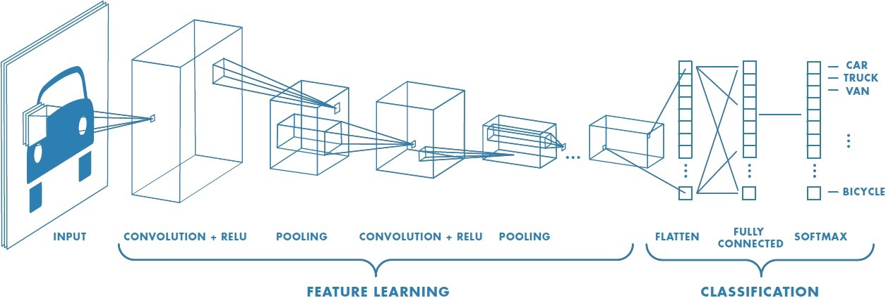
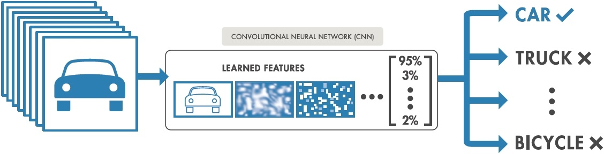
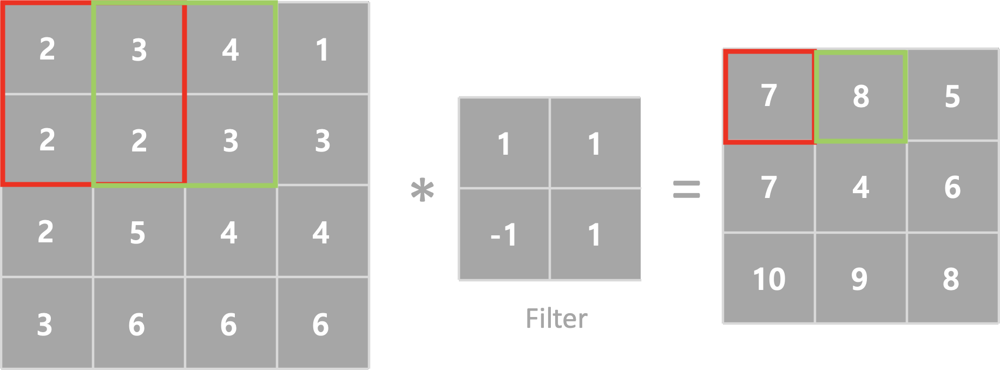
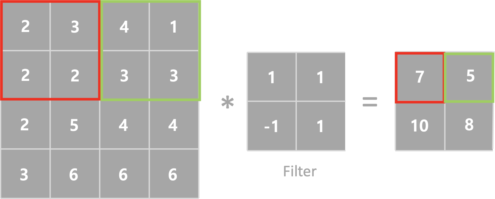
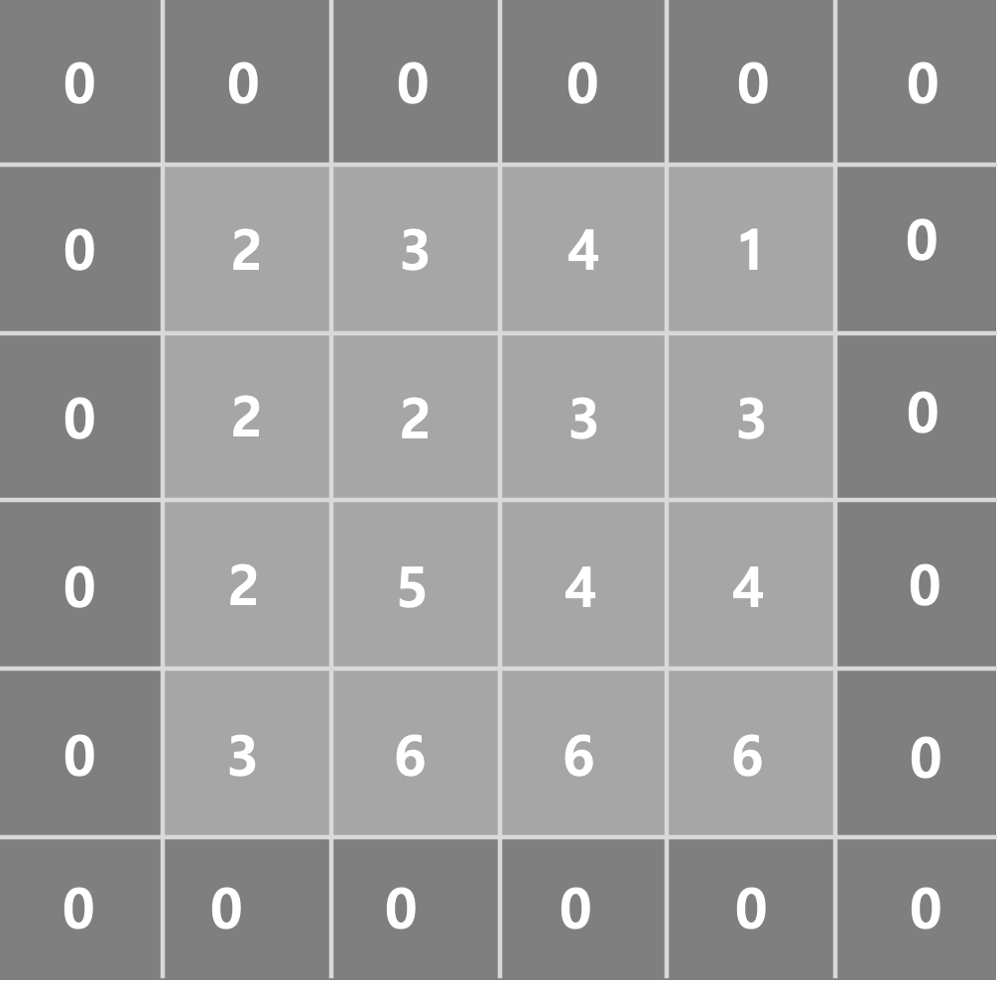
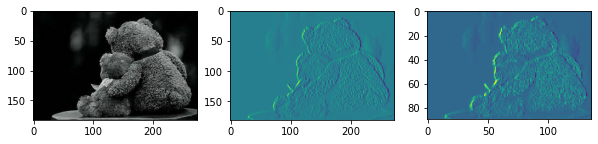

## CNN (Convolutional Neural Network)

이번시간에는 `CNN`에 대하여 알아보겠습니다. CNN 은 합성곱 신경망으로서 이미지의 특징을 검출하여 학습하는 방법입니다. DNN의 경우 MNIST에서 이미지를 판단할때 회전된 이미지의 대한 학습이 없다면 다른 이미지로 판단할 수 있습니다. 하지만 CNN 의 경우 이미지의 특징을 검출하기 시간과 효율이 좋습니다. 

하기 이미지를 보면서 설명을 해보도록하겠습니다.

<p align='center'></p>

*Image credits : [Mathworks](https://kr.mathworks.com/?s_tid=gn_logo)*

<p align='center'></p>

*Image credits : [Mathworks](https://kr.mathworks.com/?s_tid=gn_logo)*


CNN 은 Feature에 대한 학습을 먼저 진행하고 분류를 실행합니다. 특징을 학습하기 위해서 Filter 와 Convolution(합성곱)을 진행하게 됩니다. 

### Convolution (합성곱)

이미지를 입력하면 Filter와 합성곱을 통해서 새로운 이미지를 만들어 낼 수 있습니다. 


필터는 한개만 존재하지 않고 여러개가 존재할 수 있습니다. 따라서 이미지 하나에서 여러개의 Filter와 Convolution을 진행하면 Filter의 개수만큼 출력이미지를 얻을 수 있습니다.

### Strides 

Strides는 필터가 계산과정에서 이동하는 크기입니다. 기본값은 (1,1) 이며 (2,2), (3,3) 등으로 설정할수 있습니다. 하기 그림은 Strides 변환에 따른 출력이미지입니다. 



<p align='center'><b>Strides = 1</b></p>



<p align='center'><b>Strides = 2</b></p>

### Padding

위에서 확인한바와 같이 필터와 합성곱을 진행하면 출력이미지의 크기가 작아지게 됩니다. 이를 보상하기 위하여 나온 개념이 Padding 입니다. 입력데이터 가장자리에 빈 값을 채워넣어 행렬곱을 연산하는 방식이 Padding 이라고 부르며 가장자리 값이 모두 0으로 채워진 경우 Zero padding 이라고 부릅니다.

<p align='center'></p>

<div align='center'><b>Zero padding</b></div>

Padding 에는 두가지 방식이 존재합니다.

>**VALID**
>
>원본이미지에 비해 출력이미지가 작아지는 것을 허용합니다. 빈값을 채워넣지 않고 합성곱을 합니다.
>
>**Same**
>
>빈값을 넣어 원본이미지와 출력이미지가 동일한 크기가 되도록 빈값을 사용합니다.

#### 이미지 표현

코드구현에 앞서 이미지 표현에 대하여 알아보도록 하겠습니다. 이미지는 세가지로 표현할 수 있습니다.

> binary :  0과 1로표현 (0 or 1)
>
> gray scale : 무채색을 0에서 255 단계로 나누어 표현합니다. (0 ~255)
>
> color image : RGB 컬러로 표현하며 (0~255,0~255,0~255) 로 표현이 가능하다.
>
> PNG : color 이미지에서 (R,G,B Alpha) 로 표현하며 Alpha 는 이미지의 투명도를 표현한다.

코드로 구현을 해보도록 하겠습니다.

```python
%reset

import numpy as np
import tensorflow as tf
import matplotlib.pyplot as plt
import matplotlib.image as img

# sub plot을 2개 만들어 보아요!
fig = plt.figure(figsize=(10,10)) # 가로 10인치, 세로 10인치

ax1 = fig.add_subplot(1,3,1) # 1,2는 행과 열을 의미, 마지막 1은 그중 몇번째 인지를 의미
ax2 = fig.add_subplot(1,3,2) 

ori_img = img.imread('./images/Teddy.jpeg')
ax1.imshow(ori_img)


print('ori_img의 shape:{}'.format(ori_img.shape))

# convolution 연산을 수행하려면 4차원이 필요!
# 이미지가 3차원 + 그런 이미지가 여러장 이니까 4차원으로 표현!!
# 현재 shape
# 이미지 개수, height, width, color 이형식으로 convolution 입력으로 넣어요

input_image = ori_img.reshape((1,)+ ori_img.shape)
print('input_image shape : {}'.format(input_image.shape))
input_image = input_image.astype(np.float32) # 정수형 ndarray를 실수형으로 변환

# 입력이미지의 color 수를 변경 > channel을 1로 변경
input_image = input_image[:,:,:,:1]
print('변경된 input_image shape : {}'.format(input_image.shape))

# filter를 준비해야 해요!
# filter : (height, width, color, filter 개수)
# filter는 정방형 중에 3X3을 많이 사용!
# filter : (3,3,1,1)
weight = np.array([[[[-1]],[[0]],[[1]]],
                  [[[-1]],[[0]],[[1]]],
                  [[[-1]],[[0]],[[1]]]])

print(weight.shape)

sess = tf.Session()
con2d = tf.nn.conv2d(input_image,
                    weight,
                    strides=[1,1,1,1],
                    padding='VALID')
result = sess.run(con2d) # relu 가 안들어가 있어요!
print('결과 데이터의 shape : {}'.format(result.shape))

t_image = result[0,:,:,:]
print(t_image.shape)
ax2.imshow(t_image)


sess = tf.Session()
pool_process = tf.nn.max_pool(result,  
                              ksize = [1,2,2,1], 
                              strides = [1,2,2,1],
                              padding='VALID')
pool_result = sess.run(pool_process)
pool_image = pool_result[0,:,:,:]
ax3 = fig.add_subplot(1,3,3) 
ax3.imshow(pool_image)

plt.show()
```

#### 결과

<p align = 'center'></p>