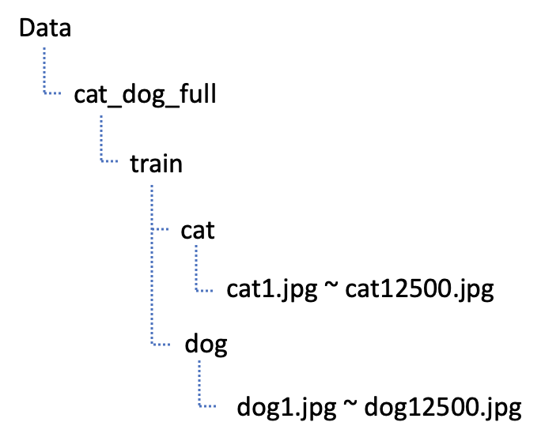

## 개와 고양이 이미지 분류 (Kaggle)

이번시간에는 개와 고양이 이미지 분류를 해보도록 하겠습니다. 이미지 분류는 `ImageDataGenerator`를 사용하여 폴더 기반으로 이미지를 분류하도록 하겠습니다. 

폴더기반으로 이미지를 분류하려면 먼저 이미지들을 각각 자신이 해당하는 폴더에 분류하여야 합니다. Drag and Drop을 통하여 폴더를 이동하는 방법도 있지만 파이썬 코드를 이용하여 폴더를 만들고 파일을 이동시켜 보도록 하겠습니다.

### 폴더이동

Training 이미지파일은 하기 코드를 통해서 '**변경 전**'에서 **'변경 후'**로 파일이동을 하도록 하겠습니다.

#### 변경 전


#### 변경 후



``` python
import os, shutil

original_dataset_dir = './Data/cat_dog/train'

base_dir = 'Data/cat_dog_full'
os.mkdir(base_dir)

train_dir = os.path.join(base_dir,'train')
os.mkdir(train_dir)
validation_dir = os.path.join(base_dir,'validation')
os.mkdir(validation_dir)
test_dir = os.path.join(base_dir,'test')
os.mkdir(test_dir)


train_cats_dir = os.path.join(train_dir,'cats')
os.mkdir(train_cats_dir)
train_dogs_dir = os.path.join(train_dir,'dogs')
os.mkdir(train_dogs_dir)

validation_cats_dir = os.path.join(validation_dir,'cats')
os.mkdir(validation_cats_dir)
validation_dogs_dir = os.path.join(validation_dir,'dogs')
os.mkdir(validation_dogs_dir)

test_cats_dir = os.path.join(test_dir,'cats')
os.mkdir(test_cats_dir)
test_dogs_dir = os.path.join(test_dir,'dogs')
os.mkdir(test_dogs_dir)

## file 복사 ##
## 고양이와 멍멍이가 각각 12,500개
## train : 7,000 
## validation : 3,000
## test : 2,500 

fnames = ['cat.{}.jpg'.format(i) for i in range(7000)]
for fname in fnames:
    src = os.path.join(original_dataset_dir,fname)
    dst = os.path.join(train_cats_dir, fname)
    shutil.copyfile(src,dst)

fnames = ['cat.{}.jpg'.format(i) for i in range(7000,10000)]
for fname in fnames:
    src = os.path.join(original_dataset_dir,fname)
    dst = os.path.join(validation_cats_dir, fname)
    shutil.copyfile(src,dst)

fnames = ['cat.{}.jpg'.format(i) for i in range(10000,12500)]
for fname in fnames:
    src = os.path.join(original_dataset_dir,fname)
    dst = os.path.join(test_cats_dir, fname)
    shutil.copyfile(src,dst)
    
fnames = ['dog.{}.jpg'.format(i) for i in range(7000)]
for fname in fnames:
    src = os.path.join(original_dataset_dir,fname)
    dst = os.path.join(train_dogs_dir, fname)
    shutil.copyfile(src,dst)

fnames = ['dog.{}.jpg'.format(i) for i in range(7000,10000)]
for fname in fnames:
    src = os.path.join(original_dataset_dir,fname)
    dst = os.path.join(validation_dogs_dir, fname)
    shutil.copyfile(src,dst)

fnames = ['dog.{}.jpg'.format(i) for i in range(10000,12500)]
for fname in fnames:
    src = os.path.join(original_dataset_dir,fname)
    dst = os.path.join(test_dogs_dir, fname)
    shutil.copyfile(src,dst)
```

### ImageDataGenerator

``` python
% reset
% matplotlib inline

import numpy as np
import pandas as pd
import tensorflow as tf
import matplotlib.pyplot as plt
from tensorflow.keras.preprocessing.image import ImageDataGenerator

train_dir = './Data/cat_dog_full/train'
validation_dir = './Data/cat_dog_full/validation'

# ImageDataGenerator
train_datagen = ImageDataGenerator(rescale=1/255,)
validation_datagen = ImageDataGenerator(rescale=1/255,)


# train data를 가져오면 > x_data(독립변수, 픽셀데이터), t_data(종속변수, label)
train_generator = train_datagen.flow_from_directory(
    train_dir,                # target directory : 데이터를 어디에서 가져올건가요!
    classes=['cats', 'dogs'], # label 적용을 어떻게 할건가요? 순서대로 레이블이 적용
                              # cats :0, dogs : 1
                              # 만약 classes를 명시하지 않으면 폴더명 순서로 label 이 잡혀요!
    target_size = (150,150),  # 이미지 size scaling(크기를 150x150으로 변경해서 들고와)
    batch_size = 20,          # 한번에 20개의 이미지를 가져와요!!
                              # label에 상관없이 가져와요!
    class_mode = 'binary',    # 이진분류이기 떄문에 'binary'
                              # 만약 MNIST처럼 다중분류면 'categorical'
                              # 기본값은 'categorical'
)


validation_generator = validation_datagen.flow_from_directory(
    train_dir,
    target_size=(150, 150),
    subset='validation',
    classes=['cats', 'dogs'],
    class_mode="binary",
    batch_size = 20
)
```

### 학습

``` python
from tensorflow.keras.models import Sequential
from tensorflow.keras import layers
import numpy as np
import pandas as pd
import tensorflow as tf
from tensorflow.keras.models import Sequential
from tensorflow.keras.layers import Conv2D, MaxPooling2D, Flatten
from tensorflow.keras.layers import Dense, Dropout
from tensorflow.keras.optimizers import Adam
import matplotlib.pyplot as plt
from sklearn.model_selection import train_test_split
from sklearn.preprocessing import MinMaxScaler


model = Sequential()

model.add(layers.InputLayer(input_shape=(150, 150, 3)))
model.add(layers.Conv2D(16, (3, 3), (1, 1), 'same', activation='relu'))
model.add(layers.MaxPooling2D((2, 2)))
model.add(layers.Dropout(rate=0.3))

model.add(layers.Conv2D(32, (3, 3), (1, 1), 'same', activation='relu'))
model.add(layers.MaxPooling2D((2, 2)))
model.add(layers.Dropout(rate=0.3))

model.add(layers.Conv2D(64, (3, 3), (1, 1), 'same', activation='relu'))
model.add(layers.MaxPooling2D((2, 2)))
model.add(layers.Dropout(rate=0.3))

model.add(layers.Flatten())
model.add(layers.Dense(512, activation='relu'))
model.add(layers.Dropout(rate=0.3))
model.add(layers.Dense(1, activation='sigmoid'))

epochs = 32

with tf.device('/device:GPU:1'):


    model.compile(
        optimizer = Adam(learning_rate=1e-3),
        loss='binary_crossentropy', 
        metrics=['acc'],
    )
    
    history = model.fit_generator(
        train_generator, 
        epochs=epochs,
        steps_per_epoch=train_generator.samples // epochs, 
        validation_data=validation_generator,
        validation_steps=validation_generator.samples // epochs,
        verbose=1
    )
```
#### 결과

```bash
Epoch 32/32
437/437 [==============================] - 23s 53ms/step - loss: 0.0785 - acc: 0.9729
```

