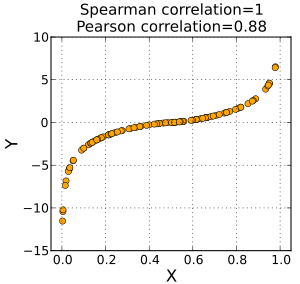
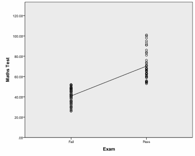

## 상관계수

이번시간에는 상관계수에 대하여 알아보도록 하겠습니다.

상관계수란 데이터가 얼마만큼 상관이 있는지를 수치로 나타낸 계수입니다. -1에서 1사이의 값을 가지며 0에 가까울수록 상관관계가 없다라는 개념입니다. 

예를들어 A라는 주식이 오를때 B주식이 오른다면 양의상관관계가 있을 것이고 A주식이 떨어질때 B의 주식이 오른다면 음의상관관계가 성립이 하게 되는 것입니다. A주식이 많이 오를때 B주식도 같이 많이 오른다면 상관계수는 1에 가까워지며, A주식이 오르는데 비해 B주식이 상대적으로 오르지 않게된다면 1보다는 0에 가까운 상관관계를 가지는 것입니다.

오늘은 상관계수 중 하기 3가지의 상관계수에 대하여 알아보도록 하겠습니다.

### 

### pearsonr 상관계수

상관계수가 두변수사이의 선형관계를 평가하는 계수입니다.

### spearmanr 상관계수

단조적 관계를 평가하는 계수입니다. 여기서 단조적 관계란 선형인지 비선형인지 판단하는 계수입니다.

### <p alinge= 'center'></p>

*Image credits : [wikipedia](https://ko.wikipedia.org/wiki/스피어만_상관_계수)*

### pointbiserialr 상관계수

하나가 연속변수이고 다른 하나고 이분변수일 때 사용하는 상관계수입니다. 

<p alinge= 'center'>

Image credits : [statisticssolutions](https://www.statisticssolutions.com/point-biserial-correlation/)

### Biserial 상관계수

하나가 연속변수이고 다른 하나고 이분변수일 때 사용하는 상관계수입니다. 하지만 Pointbiserialr과 다른점은 이분변수가 원래는 이분변수가아닌 연속변수이지만 이분화 할경우 사용됩니다.

### 사용 코드

세함수 모두 scipy모듈안에 포함되어 있으며 사용방법은 하기와 같습니다.

```python
>>> from scipy.stats import pearsonr, spearmanr, pointbiserialr
pearsonr(x, t)
spearmanr(x, t)
pointbiserialr(x, t)

#(0.86602540378443871, 0.011724811003954626)
```

