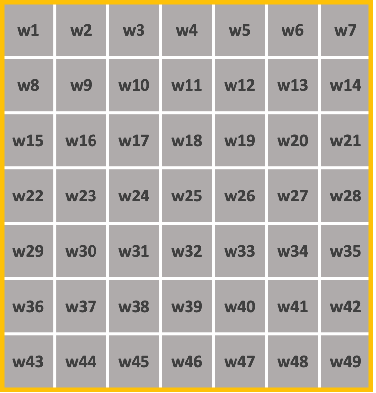

## VGG19

이번시간에는 VGG에 대하여 알아보겠습니다. VGG는 CNN Architecures에 하나로 공간데이터를 분석하는데 이점이 있습니다. VGG는 19층으로 이루어진 

VGG는 네트워크의 깊이를 깊이와 성능사이의 영향에 대하여 알기위하여 시작되었고, 깊이를 깊게하기 위하여 3X3필터를 사용하였다. 그 이유는 필터의 크기가 커지면 이미지가 쉽게 작아지기 때문에 3X3 필터를 이용했다고 보면된다. 결과적으로는 네트워크의 깊이가 깊어지면 성능이 높아진다는 것이 밝혀졌기 때문에 VGG16, VGG19와 같은 깊은 네트워크 이후로 생겨났습니다.

### 필터의 크기와의 상관관계

그렇다면 필터크기가 작은 것은 정확하게 어떤 영향을 미치는지 알아보겠습니다. 

#### 결정 함수 비선형성 증가

각 Convolution 연산은 ReLU 함수를 포함한다. 다시 말해, 1-layer 7x7 필터링의 경우 한 번의 비선형 함수가 적용되는 반면 3-layer 3x3 필터링은 세 번의 비선형 함수가 적용됩니다. 레이어가 증가함에 따라 비선형성이 증가하게 되고 이것은 모델을 잘 식별할 수 있게합니다.

#### 학습 파라미터 수 감소

Convolutional Network 구조를 학습할 때, 학습 대상인 가중치(weight)는 필터의 크기에 해당합니다.

7x7 이미지에 대하여 학습을 진행한다고 가정해 보도록 하겠습니다. 

3x3필터의 경우 3x3연산을 3번을 실시하면 1x1 이미지로 출력이 됩니다.

7x7필터의 경우 1번을 실시하면 1x1 이미지로 출력이 됩니다.

즉 7x7필터 1개에 대한 학습 파라미터 수는 49인 것에 반해 3x3 필터 3개에 대한 학습 파라미터 수는 27(3x3x3)이 된다. 3x3 필더가 연산이 더많아지지만 이것은 단순연산이고 가중치를 업데이트하는 것보다는 시간이 적게소요되기 때문에 3x3필터를 적용하는 것이 결과적으로 층을 더욱 깊고 연산속도를 빠르게 할 수 있습니다.

### VGG-16 Architecture

- **13 Convolution Layers + 3 Fully-connected Layers**
- **3x3 convolution filters**
- **stride: 1 & padding: 1** : 이미지 사이즈 유지 
- **2x2 max pooling **(stride : 2) : 특징맵을 1/4로 축소
- **ReLU**
- **1x1 Conv Layer** (1x1 filter, stride = 1) : 차원축소로 인한 연산량 감소가 목적
- **Fully-Connected Layer** (4096 -> 4096 -> 1000) : 세 장으로 고정된 FCL 사용

