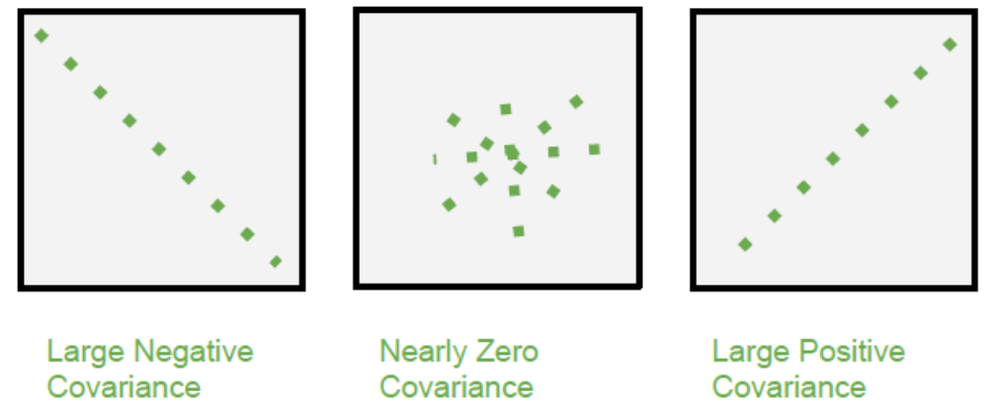

## 기초이론

이번시간에는 논문과 CNN 구조를 이해하기 위하여 기초이론에 대하여 알아보도록 하겠습니다.

### 공분산 (covariance)

`공분산` 은 확률론과 통계학에서 2개의 확률변수의 상관정도를 나타내는 값입니다. 1개의 이산정도를 나타내는 분산과는 다르게 2개의 확률변수를 다룬다는점이 차이점이라고 보시면 되겠습니다. 상관계수의 원리와 마찬가지로 하나의 변수가 상승하는 경향을 보일때 다른 변수도 상승하는 경항을 보인다면 공분산의 값은 양수 그 반대의 상황에서는 음수라고 보시면 되겠습니다.

다만 각자 가진 측정단위가 다르기 때문에 공분산을 통해서는 상관관계의 경향은 이해가 가능하나 정도는 파악하기 어렵습니다. 

### 상관분석

#### 단순 상관분석

두 변수간에 어떤 선형적 혹은 비선형적 관계를 갖고 있는지 확인하는 방법입니다. 

#### 다중상관분석

3개이상의 변수간 관계 강도를 측정하는 방법입니다.

#### 평상관계 분석

다중상관분석에서 다른변수와의 관계를 고정하고 두변수의 관계강도를 나타내는 방법입니다.

### 상관 관계

상관 관계는 두 변수간의 관계의 강도를 나타내는 수치입니다.

*Image credits : [geeksforgeeks](https://www.geeksforgeeks.org/mathematics-covariance-and-correlation/)*

### 

