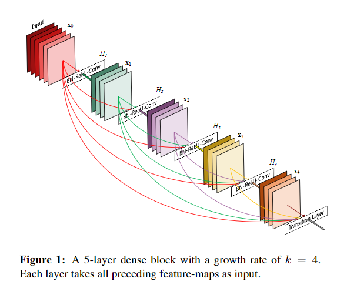

## DenseNet (작성중)

이번 시간에는 빠르게 DenseNet에 대하여 알아보겠습니다. DenseNet은 다른 알고리즘과는 다르게 각각의 Layer의 output이 다음 모든 Layer로 전파하는 구조로 되어있습니다.

기존 Convolution layer의 경우에는 N개의 layer에 대하여 N번이 연결이 되어있다면, DenseNet은 모든층이 전부다 연결되어 N(N+1) / 2 번의 연결이 되어있습니다.

그렇다면 이런 구조는 어떠한 장점을 가지는지 알아보도록 하겠습니다.

### Non-Washing Gradient

앞선 포스트에서 설명한 것과 같이 Layer가 많아지면 많아질수록 Gradient Vanishing 현상이 발생합니다. 하지만 Input과 output Layer 간의 short Connection이 존재할 경우 깊고 효율적으로 학습이 가능합니다. DenseNet의 경우에는 모든 Layer 층이 직접연결되어 효율적으로 학습이 가능합니다.

### Stateless

