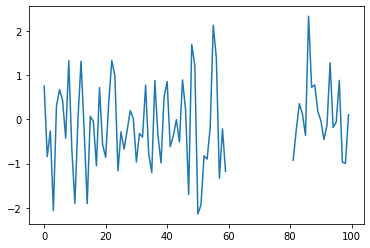
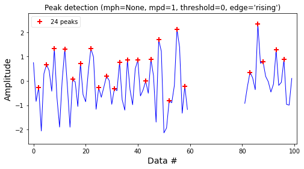
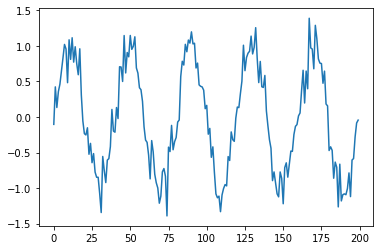
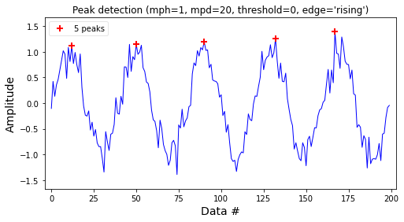
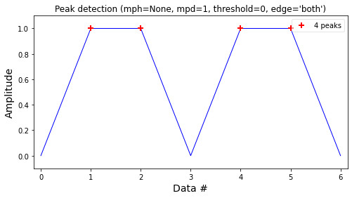
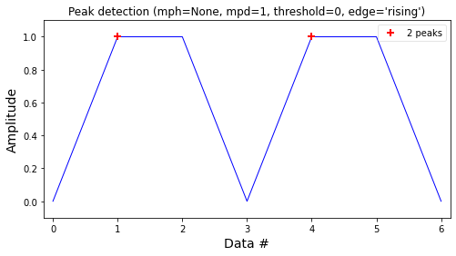
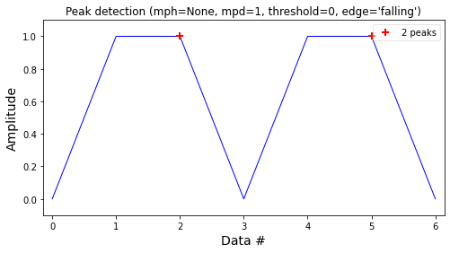
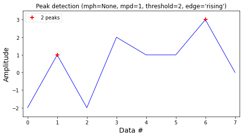

## Peak Detection

이번시간에는 Data에서 Peak를 찾아주는 방법을 알아보도록 하겠습니다. 데이터를 다루면서 유의미한 데이터를 찾기는 힘든데요. 오늘은 수많은 데이터 중에서 Peak 를 찾아보고 조건도 같이 걸어보도록 하겠습니다.




<p align='center'><b>pig 1. Raw data</b></p>

pig 1에서 Peak를 찾는 일은 귀찮은 일입니다. 각각 점들의 좌우 관계를 보고 좌측이 상승 우측이 하강이라는 조건식을 만들고 그것을 다시 판단을 해야하는데요. 이것을 `Detecta` 의 `detect_peaks` 기능을 이용하여 쉽게 구현해보도록 하겠습니다.

``` python
from detecta import detect_peaks
import numpy as np
import matplotlib.pyplot as plt
%matplotlib 

ind = detect_peaks(x, show=True)
print(ind)
# [ 2  5  8 12 15 18 22 25 28 31 33 36 40 43 45 48 52 55 58 83 86 88 93 96]

```



<p align='center'><b>pig 2. detect_peaks</b></p>

pig2 처럼 쉽게 peak 점을 찾을 수 있고 각 Peak점에서의 x 좌표까지 쉽게 나타낼 수 있습니다.

다음은 조건을 걸어 Peak point를 찾아보겠습니다.



<p align='center'><b>pig 3. Raw Data</b></p>



<p align='center'><b>pig 4. mph, mpd </b></p>

pig 4를 보시면 pig 2와는 다르게 모든 peak point 가 아닌 간격과 높이의 조건이 들어간 것을 볼 수 있습니다. 바로 mph, mpd 즉 높이와 거리의 조건을 주어 peak point를 찾은 것입니다. 코드는 하기와 같습니다.

``` python
# 1밑 으로는 찾지 않음, 피크간의 최소거리는 20초과
ind2 = detect_peaks(x, mph=1, mpd=20, show=True)  
print(ind2)
```

그렇다면 최저점을 어떻게 찾을까요 ?? 바로 `valley = True` 를 사용하여 찾을 수 있습니다. 

```python
detect_peaks(x, mph = -1.2, mpd=20, valley = True, show=True) # 최고점 대신에 최저점을 찾음
```

다음으로는 Edge기능을 알아보겠습니다.

``` python
x = [0, 1, 1, 0, 1, 1, 0]
detect_peaks(x, edge='both', show=True)
detect_peaks(x, edge='rising', show=True)
detect_peaks(x, edge='falling', show=True) 
```







`both`의 기능은 떨어지는 지점과 솟아오르는 점을 둘다 찾아내고 `rising`의 기능은 솟아오르는 점만 마지막으로 `falling` 은 떨어지는 점만 찾아냅니다.


마지막으로, `Threshold` 기능에 대하여 알아보겠습니다.

```python
x = [-2, 1, -2, 2, 1, 1, 3, 0]
# set threshold = 2
detect_peaks(x, threshold = 2, show=True)
```




`threshold` 기능은 Peak의 좌우의 차이가 설정한 값보다 큰 경우의 peak point만 찾아냅니다.

이번시간에는 Peak 점을 찾는 방법에 대하여 알아보았습니다.