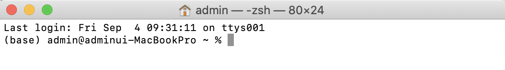

## ANACONDA

오늘은 `ANACONDA` 에 대하여 알아보도록 하겠습니다. 

`ANACONDA` 를 사용하는 이유는 다음과 같습니다. 

1. 라이브러리를 별도로 설치하지 않아도 된다.
2. 가상환경을 사용할 수 있다.

### ANACONDA 설치

그렇다면 우선 설치부터 해보도록 하겠습니다.

1. [아나콘다 다운로드 링크](https://www.anaconda.com/products/individual) 에 접속하여 해당되는 버전을 다운로드 하도록 하겠습니다. 
> 저는 MAC 환경에서 사용하므로 MAC 버전용으로 다운로드 하도록 하겠습니다.

2. 다운로드가 되었다면 별다른 설정없이 설치를 해주시면 됩니다. 
> 다만 윈도우 사용자분들께서는 경로설정(path)를 유의하시어 설치하시면 되겠습니다.


### 가상환경 생성

설치가 완료되었다면 가상환경을 만들어 보도록 하겠습니다. 

`Mac`사용자분들을 `터미널`을 열어주시고 `윈도우` 사용자분들께서는 `Anaconda prompt`를 실행시켜주시면 되겠습니다.

실행하시면 이전과는 다르게 (base) 라는 부분이 생성이 되어있는 것을 확인하실 수가 있습니다. 



1. 가상환경이름은 "data_env" 로 지정하고 파이썬 버전은 3.7 버전으로 설치하겠습니다. 
>``` shell
>$ conda create -n data_env python=3.7 openssl
>```
2. 설치가 다 되었다면 제대로 설치가 되어있는지 확인하겠습니다.
>``` shell
>$ conda info -—envs
>```
3. 만들어진 가상환경으로 접속합니다. 
>``` shell
>$ conda activate data_env
>```
4. 가상환경을 탈출하기 위해서는 하기 명령어를 입력합니다.
>``` shell
>$ conda deactivate
>```

## Jupyter notebook
가상환경 설치가 완료되면 개발도구인 IDE를 설치를 해야합니다.
저는 Jupiter notebook이라는 web기반의 개발툴을 이용하겠습니다.

현재 data_env 가상환경에서 하기명령어를 이용하여 nb_conda를 설치하도록 하겠습니다.
``` shell
$ conda install nb_conda
```


### 경로설정 

Jupyter notebook 이 사용할 기본 디렉토리 (working directory)를 지정 하도록 하겠습니다.
이 작업을 하기위해 환경 설정 파일을 하나 생성해서 기본 디렉토리를 지정해서 사용해보도록 하겠습니다.

``` shell
$ jupyter notebook --generate-config
```

명령어를 입력하면 `.jupyter` 라는 숨김폴더가 생성되고 그 안에` jupter_notebook_config.py` 파일이 생성됩니다.

그 중 `jupter_notebook_config.py` 파일에서 하기항목에 경로이름을 입력하여 기본 디렉토리 (working directory)를 설정하겠습니다. 

> ##The directory to use for notebooks and kernels.
> #c.NotebookApp.notebook_dir = '경로이름'


### Jupyter Notebook 실행 

상기 설정이 전부 완료되었다면 `Jupyternotebook`을 실행해보도록 하겠습니다.

``` shell
$ jupyter notebook
```

명령어를 입력하면 바로 Jupyter Notebook이 실행되는 것을 확인할 수 있습니다.


오늘은 `Anaconda`와 `Jupyternotebook`에 대하여 알아보았습니다.