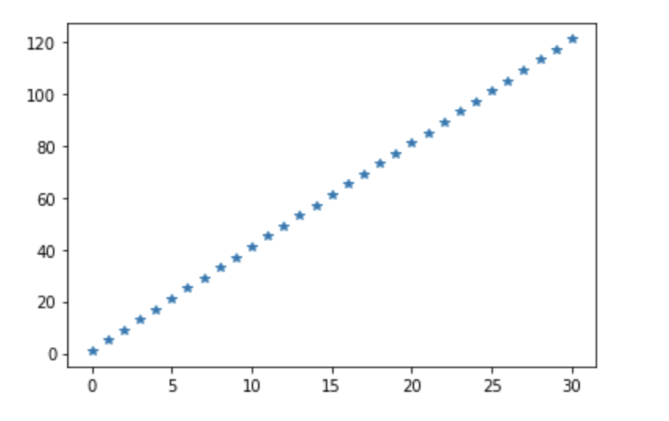
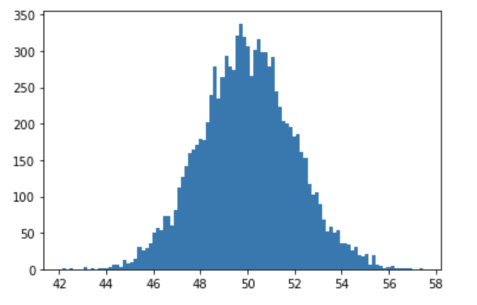
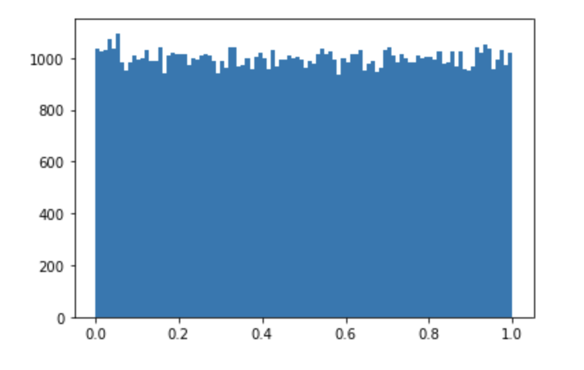
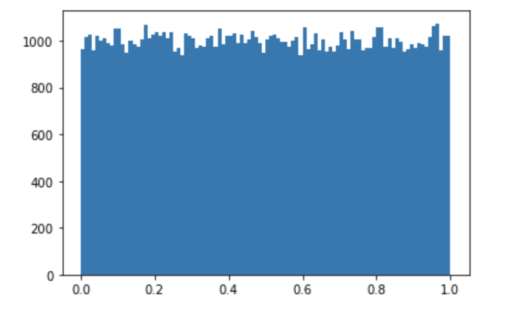
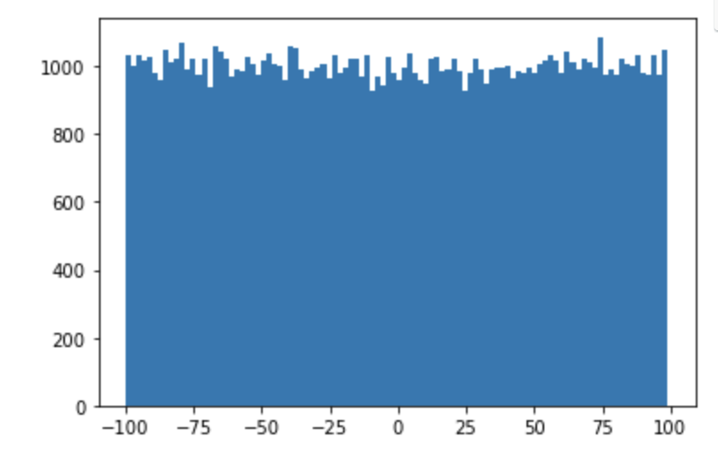
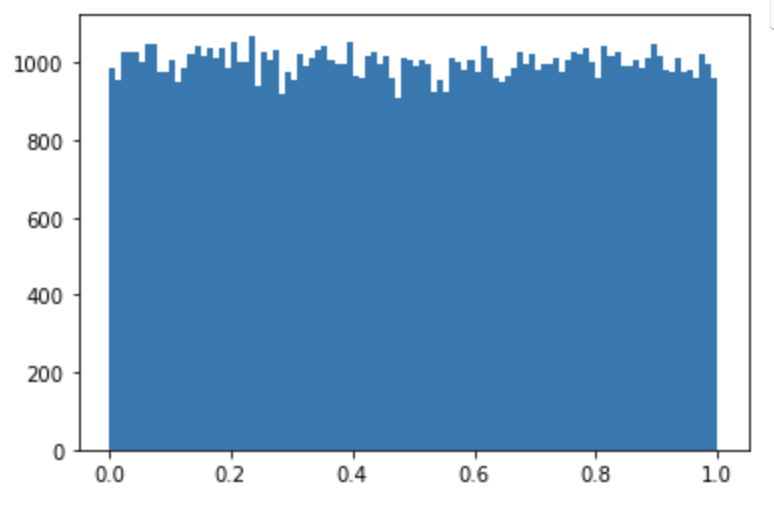

## Numpy

오늘은  `Numpy` 에 대하여 알아보도록 하겠습니다. `Numpy` 란 Numerical Python 의 약자입니다. 대규모 다차원 배열과 행렬 연산에 필요한 다양한 함수를 제공합니다.

### Numpy module

Numpy의 자료구조를 배워보도록 하겠습니다. `ndarray` 배열에 대하여 배워보도록 하겠습니다.

Numpy는 `ndarray` 라고 불리는 n-차원의 배열을 제공합니다.

### Numpy & Pandas

`pandas module`은  data handling, machine learing 에 학습할 데이터를 준비하는 module입니다. 

Numpy는 vector와 matrix 연산에 특화되어 있습니다. 또한 Pandas와 Matplotlib의 기반이 되는 module 이며 machine learning, deep learning 에서 많이 사용됩니다.

### Numpy 설치

numpy를 실행해보아요 !! 하지만 깔려있지 않기 때문에 Numpy 모듈을 설치하고 진행해야 합니다.

설치하는 방법에는 두가지 방법이 있습니다.

1. Pip3 install numpy

2. conda install numpy

 주의 할점은 꼭 설정된 가상환경을 활성화 시킨 이후에 명령어를 작성하셔야 합니다.

### Numpy VS List

ndarray의 특징 : python의 list와 상당히 유사  (표로 작성해봅시다 !!)

1. python의 list 는 다른 데이터 타입을 같이 list안에 저장이 가능합니다.
2. Numpy의 ndarray는 모두 같은 데이터 타입을 사용해야 해요.
3. Python의 list 보다 메모리 효율이나 실행속도면에서 우위가 있습니다.

하기 예제를 보면서 차이점을 찾아보도록 하겠습니다. 

``` python
#### List

a = [1,2,3,4,5] # python의 list
print(a) # [1,2,3,4,5] > list literal
print(type(a))# <class 'list'>

#### Numpy

import numpy as np
arr = np.array([1,2,3,4,5])
arr = np.array(파이썬의 list)
print(arr) #[1 2 3 4 5] 콤마로 구분되지 않고 띄어쓰기로 구분됩니다.
print(type(arr)) # <class 'numpy.ndarray'>
print(arr.dtype) # int64(int : 정수, 64:64bit)
print(arr[0]) # 1 > python 에서는 'int'
print(type(arr[0])) # <class 'numpy.int64'> class type이 다름 
arr = np.array([100,3.14,True,'Hello']) # Numpy 안에는 같은 데이터 타입이 들어가야합니다.
print(arr) # ['100' '3.14' 'True' 'Hello'] 가능한 데이터 타입을 일치시켜서 출력
```


다차원 ndarray를 만들어 보아요!
Python의 list는 중첩리스트만 존재해요!

a = [[1,2,3],
     [4,5,6]] # python 에서는 2차원 리스트라고 부르지는 않아요 !

arr = np.array(a)
print(arr)
print(arr[1] [1])


a = [[1,2,3],
     [4,5,6]] # python 에서는 2차원 리스트라고 부르지는 않아요 !
arr = np.array(a, dtype =np.float64)# 지정하지 numpy가 자동으로 판단해서 지정
print(arr)

[[1. 2. 3.]
 [4. 5. 6.]]


### ndarray의 차원 관련 속성을 알아보아요!!

```python

a = [1, 2, 3, 4]
arr = np.array(a, dtype=np.float64)
print(arr) #[1. 2. 3. 4.]
print(arr.ndim) #ndim > 차원의 개수 : 1
print(arr.shape) # 차원의 개수와 각차원의 요소를 tuple로 표현 
								 # (4,)
  
a = [[1, 2, 3],
     [4, 5, 6],
     [7, 8 ,9],
     [10, 11, 12]]
arr = np.array(a, dtype=np.float64)
print(arr)
print(arr.ndim) #ndim > 차원의 개수 : 2
print(arr.shape) # 차원의 개수와 각차원의 요소를 tuple로 표현
                 # (4, 3)
  
a = [[[1, 2, 3],
     [4, 5, 6]],
     [[1, 2, 3],
     [4, 5, 6]]]
arr = np.array(a, dtype=np.float64)
print(arr)
'''
[[[1. 2. 3.]
  [4. 5. 6.]]

 [[1. 2. 3.]
  [4. 5. 6.]]]
 '''
print(arr.ndim) #ndim > 차원의 개수 : 3
print(arr.shape) # 차원의 개수와 각차원의 요소를 tuple로 표현
                 # (2, 2, 3)
```


### numpy array(ndarray)의 크기를 알아보아요!

```python
a = [[1,2,3], [4,5,6], [7,8,9], [10,11,12]] # 4 X 3
arr = np.array(a, dtype = np.float64)
print(arr)
print(arr.size) # 12 // 현재 np가 가지고 있는 모든요소의 개수
print(len(arr)) #4 // 첫번째 차원의 요소 개수를 리턴 // 행의 개수를 리턴합니다.
print(arr.shape) # (4,3)

arr.shape = (2, 6) # shape을 변경이 가능
print(arr)
'''
[[ 1.  2.  3.  4.  5.  6.]
 [ 7.  8.  9. 10. 11. 12.]]
'''

arr.shape = (3, 2, 2)
print(arr)
'''
[[[ 1.  2.]
  [ 3.  4.]]

 [[ 5.  6.]
  [ 7.  8.]]

 [[ 9. 10.]
  [11. 12.]]]
'''

arr.shape = (3, 2, 3) # size는 맞춰서 shape이 변경가능
print(arr)
'''
---------------------------------------------------------------------------
ValueError                                Traceback (most recent call last)
<ipython-input-41-11d631f7d9d2> in <module>
     14 print(arr)
     15 
---> 16 arr.shape = (3, 2, 3)
     17 print(arr)

ValueError: cannot reshape array of size 12 into shape (3,2,3)
'''
```


### ndarray의 데이터 타입을 변경하려면??

ndarray를 생성할 때 dtype을 지정해서 만들지만 변경이 가능합니다. 바로 `astype` 을 통해서 변경이 가능합니다.

하기 예제를 통해서 알아보도록 하겠습니다.

``` python
import numpy as np
arr = np.array([1.5, 2.3, 8.3, 9.8, 7.7], dtype = np.float64)
print(arr) # [1.5 2.3 8.3 9.8 7.7]
 
result = arr.astype(np.int32)
print(result) # [1 2 8 9 7] // 정수형태로 변환되며 버림처리됩니다.
print(result.dtype) #int32
```


### ndarray를 만드는 형태는 여러가지입니다.

``` python
import numpy as np
arr = np.zeros((3,4)) #0으로 채워서 ndarray를 만들수 있어요
print(arr)
'''
[[0. 0. 0. 0.]
 [0. 0. 0. 0.]
 [0. 0. 0. 0.]]
'''

arr = np.ones((3,4))
print(arr)
'''
[[1. 1. 1. 1.]
 [1. 1. 1. 1.]
 [1. 1. 1. 1.]]
'''

arr = np.full((3,5), 7, dtype=np.float64)
print(arr)
'''
[[7. 7. 7. 7. 7.]
 [7. 7. 7. 7. 7.]
 [7. 7. 7. 7. 7.]]
'''


arr = np.empty((3,3)) # 3 X 3 ndarray 를 생성하는데 ..초기값을 주지않아요
                      # 내가 원하는 shape의 공간만 설정 // 초기화 하지않아 만드는 속도가 빨라서 사용
print(arr)
'''
[[ 6.17779239e-31 -1.23555848e-30  3.08889620e-31]
 [-1.23555848e-30  2.68733969e-30 -8.34001973e-31]
 [ 3.08889620e-31 -8.34001973e-31  4.78778910e-31]]
'''

```

#### _like


``` python
arr = np.array([(1,2,3), (4,5,6)])
print(arr)
'''
[[1 2 3]
 [4 5 6]]
'''

result = np.zeros_like(arr) # 위에서 만든 2 X 3 행렬에 대하여 동일한 size의 행렬을 만들어요
print(result)
'''
[[0 0 0]
 [0 0 0]]
'''
```


#### ndarray를 만드는 다른 방법 - arange

python의 range와 상당히 유사합니다. 

주어진 범위 내에서 지정한 간격으로 연속적인 원소를 가진 ndarray를 생성합니다.

하기 예제를 보면서 확인해보록 하겠습니다.

```python
a = range(1,10,1)
print(a) # range(1, 10)

arr = np.arange(1,10,1)
print(arr) # [1 2 3 4 5 6 7 8 9]
```


#### ndarray를 만드는 다른 방법 - linspace

linspace 기능을 확인하기 위해서 그래프로 데이터를 그려보도록 하겠습니다. `matplotlib module`, ` seaborn` 라는 모듈을 이용해서 그래프를 그릴 수 있습니다.

이번시간에는 matplotlib을 사용해보도록 하겠습니다. 이것도 마찬가지로 pip 혹은 conda를 이용해서 설치하도록 하겠습니다.

 `conda install matplotlib` 의 설치명령어로 터미널을 통해서 설치하도록 하겠습니다.

설치 이후 간단한 예제를 통하여 linspace를 자세하게 알아보도록 하겠습니다.

``` python
import numpy as np
import matplotlib.pyplot as plt
'''
np.linspace(start, stop, num) 
start 부터 시작해서 stop의 범위에서 num개의 숫자를 
균일한 간격으로 데이터를 생성해서 ndarray를 만드는 함수
'''

arr = np.linspace(0,10,11)
print(arr) #[ 0.  1.  2.  3.  4.  5.  6.  7.  8.  9. 10.]


arr = np.linspace(0,10,13)
print(arr)
'''
[ 0.          0.83333333  1.66666667  2.5         3.33333333  4.16666667
  5.          5.83333333  6.66666667  7.5         8.33333333  9.16666667
 10.        ]
'''


arr = np.linspace(1,121,31) #원소간의 간격은 (stop - start) / (num -1)
print(arr)

'''
[  1.   5.   9.  13.  17.  21.  25.  29.  33.  37.  41.  45.  49.  53.
  57.  61.  65.  69.  73.  77.  81.  85.  89.  93.  97. 101. 105. 109.
 113. 117. 121.]
'''

plt.plot(arr, "*") # 각각의 점들을 *로 표시하여 나타냅니다.
plt.show()
```





####  ndarray를 생성할 때 랜덤값 기반으로 생성할 수 있어요

총 다섯가지 방법으로 ndarray를 생성할 수 있어요!!

1. np.random.normal() : 정규분포 확률 밀도함수에서 실수 표본을 추출해서 ndarray 생성 (평균, 표준편차)

   ```python
   import numpy as np
   import matplotlib.pyplot as plt
   
   mean = 50
   std = 2
   arr = np.random.normal(mean, std, (10000,)) # 10000개의 데이터 추출
   print(arr)
   '''
   [47.48597904 51.09675807 48.58847913 ... 48.31064207 47.61720963
    50.06721122]
   '''
   
   # 히스토그램
   plt.hist(arr, bins = 100) # 히스토그램의 x축의 간격을 100개로 쪼개서 만듦
   plt.show()
   ```

   




2. np.random.rand() : 실수를 추출하는데 (0,1) 범위에서 추출하고 균등분포로 추출

   ``` python
   arr = np.random.rand(100000)
   print(arr)
   plt.hist(arr, bins=100)
   plt.show()
   ```

   

   

3. np.random.randn(d0,d1,d2, ...) : 실수추출 , 표준정규분포에서 난수를 추출 평균0, 표준편차 1

   ```python
   arr = np.random.rand(100000)
   print(arr)
   plt.hist(arr, bins=100)
   plt.show
   ```




4. np.random.randint(low,high, shape) : 균등분포 확률밀도함수에서 난수를 추출하는데 정수값을 난수로 추출

   ```python
   arr = np.random.randint(-100,100,(100000, ))
   print(arr)
   plt.hist(arr, bins =100)
   plt.show()
   ```

   

5. np.random.random(shape) : [0,1) 균등분포에서 실수 난수를 추출!

   ```python
   arr = np.random.random((100000, ))
   print(arr)
   plt.hist(arr, bins=100)
   plt.show()
   ```

   


#### Numpy 가 제공하는 랜덤 관련 함수

1. 난수의 재현

   하기코드로 작성하면 매번 실행시 마다 새로운 random 값이 도출됩니다. 

   ``` python
   arr = np.random.randint(0, 100, (10,))
   print(arr) # [60 72  4  8 98 88 69 54 83 30]
   ```
   

   하지만 랜덤 값도 실제로는 특정 알고리즘의 결과물이기에 초기에 시작값을 설정해주면 항상 같은 랜덤값이 도출됩니다.
   
   ``` python
   np.random.seed(10) # 한번뽑은 랜덤값을 같은값으로 도출되도록 설정
   arr = np.random.randint(0, 100, (10,))
   print(arr) 
   '''
   [ 9 15 64 28 89 93 29  8 73  0]
   [ 9 15 64 28 89 93 29  8 73  0]
   [ 9 15 64 28 89 93 29  8 73  0]
   [ 9 15 64 28 89 93 29  8 73  0]
'''
   ```
   
   

2. ndarray의 순서를 램덤하게 바꿀려면 어떻게 해야하나요?

   ``` python
   arr = np.arange(10)
   print(arr) # [0 1 2 3 4 5 6 7 8 9]
   
   np.random.shuffle(arr) # ndarray 자체가 변형되요!
   print(arr) # [1 5 2 9 7 0 3 4 6 8]
   ```


3. ndarray 안에서 일부 부작위로 선택하는 기능. sampling기능을 수행하려면

   np.random.choice(arr, size, replace, p)

   arr : numpy array가 나오거나 혹은 정수가 나올 수 있어요! 만약 정수면
         정수만 쓰면 : arange(정수) 가 실행
   size : 정수값. 샘플의 숫자
   replace : Boolean (True, False)
             True : 한번 선택한 데이터를 다시 샘플링 할 수 있어요!
   p(확률) : ndarray. 각 데이터가 샘플링 될 확률을 가지고 있는 ndarray

   ``` python
   arr = np.random.choice(5,3,replace = True )
   print(arr) #[1 1 3] 값 중복 가능
   
   arr = np.random.choice(5,3,replace = False )
   print(arr) #[0 4 1] 값 중복 불가능
   
   arr = np.random.choice(5,10,replace = True,p = [0.2, 0, 0.3, 0.4, 0.1]  )
   print(arr) #[0 2 0 3 2 0 3 0 2 3] 1은 0%이기 때문에 나올 수가 없음
   ```


ndarray는 shape을 가지고 있어요!

``` python
# shape 속성의 값을 바꾸어서 ndarray의 형태를 변경하는 것은 그다지 좋지 않아요!
# reshape() 항수를 이용해서 처리합니다.

import numpy as np
arr = np.arange(0,12,1)
arr1 = arr.reshape(4,3) # 새로운 ndarray를 만드는게 아니라 view를 생성.
print (arr)
print (arr1)

'''
[ 0  1  2  3  4  5  6  7  8  9 10 11]

[[ 0  1  2]
 [ 3  4  5]
 [ 6  7  8]
 [ 9 10 11]]
'''

arr[0] =100
print(arr) 
print(arr1) #데이터 공유

'''
[100   1   2   3   4   5   6   7   8   9  10  11]

[[100   1   2]
 [  3   4   5]
 [  6   7   8]
 [  9  10  11]]
'''

arr = np.arange(0,12,1)
arr1 = arr.reshape(-1,4)
print(arr1)

'''
[[ 0  1  2  3]
 [ 4  5  6  7]
 [ 8  9 10 11]]
'''

arr = np.arange(0,12,1)
arr1 = arr.reshape(2,3,-1)
print(arr1)
'''
[[[ 0  1]
  [ 2  3]
  [ 4  5]]

 [[ 6  7]
  [ 8  9]
  [10 11]]]
'''


arr = np.arange(0,12,1)
arr1 = arr.reshape(2,6).copy() # 데이터 공유하지않고 새로운 ndarray를 제작하려면 ?
arr[0] =100
print(arr)
print(arr1)

'''
[100   1   2   3   4   5   6   7   8   9  10  11]

[[ 0  1  2  3  4  5]
 [ 6  7  8  9 10 11]]
'''
```


