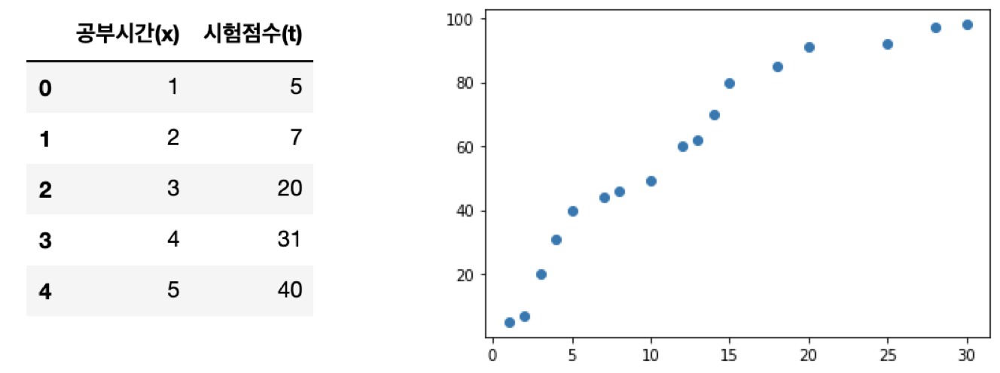
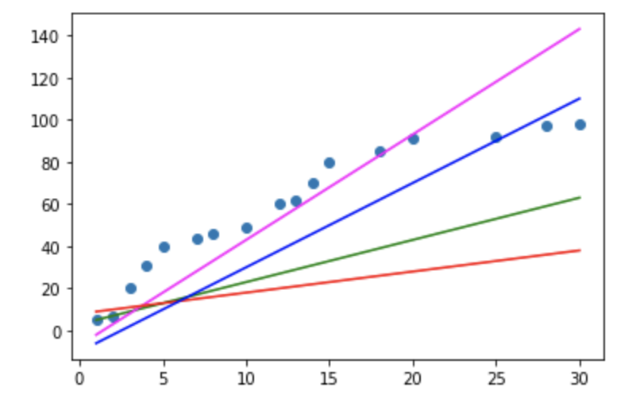
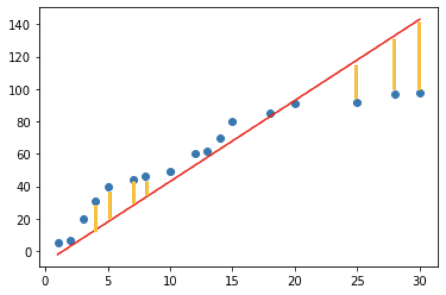
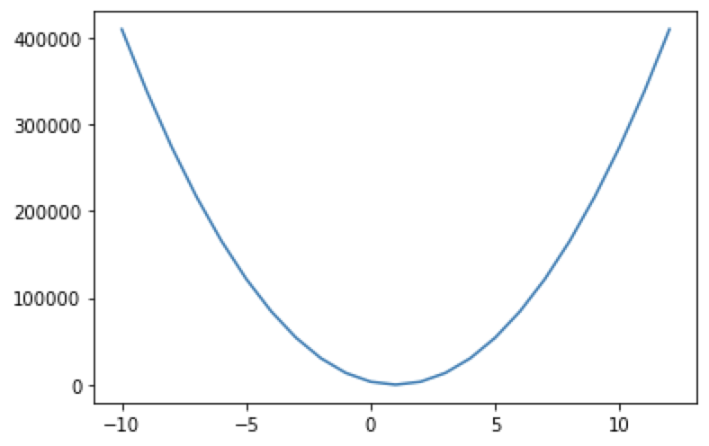

## Machine Learning

Machine Learning 은 학습방법에 따라서 크게 4가지로 분류합니다. 
1. 지도학습(Supervised Learning)

2. 비지도학습(Unsupervised Learning)

3. 준지도학습(SemiSupervised Learning)

4. 강화학습(Reinforcement Learning)

간단한 이론부터 먼저 알아보고 세부적으로 알아보도록 하겠습니다.

### 지도학습 (Supervised Learning)

지도학습은 학습에 사용되는 데이터와 그 정답(label)을 이용해서 데이터의 특성과 분포를 학습하고 미래결과를 예측하는 방법

1. Regression(회귀)

   - 학습된 결과를 바탕은 연속적인 숫자값을 예측

   - Linear Regression(선형회귀)  : '얼마나'를 예측하는 방법

2. Classification(분류)

   - binary classification (둘 중 하나를 예측)
   - multinomial classification (여러 개 중 하나를 예측)

### 비지도학습 (unsuperviese learning)

비지도학습은 학습에 사용되는 데이터가 label 이 없는 데이터가 사용됩니다. 이 부분이 지도학습과 가장 큰 차이입니다.
비지도학습은 정답(label)이 없는 데이터만을 이용하기 떄문에 입력값 자체가 가지고 있는 특성과 분포를 이용해서 Grouping하는 `Clustering(군집화)`하는데 주로 사용합니다.

##### Classification(분류) VS clustering(군집화)

1. Clustering(군집화) : 비슷한 데이터끼리 Grouping 해주는 것 

2. Classification(분류) : 어떤 분류에 속하는가에 대한 정답을 예측.


### 준지도학습 (SemiSupervised Learning)

 지도학습 + 비지도학습 데이터의 일부분만 label 이 제공되는 경우!!

### 강화학습 (Reinforcement Learning)

위에서 말한 3가지 방식과는 완전히 다른 학습 방법 Agent, Environment, Action, Reward 개념을 이용
게임쪽에서 많이 사용되는 학습방법 google 알파고의 메인 알고리즘이 바로 이 강화학습.


많은 학습방법이 있지만 이번시간에는 지도학습에 대하여 알아보도록 하겠습니다. 먼저 실습에 앞서 미분에 대하여 간략하게 정리하고 넘어가도록 하겠습니다.


### 미분

어떤 함수의 정의역 속 각점에서 독립변수의 값의 변화량과 함수 값의 변화량 비율의 극한 혹은 극한의 집합. 치역으로 가지는 새로운 함수입니다. 

미분에는 크게 두가지 방식이 있습니다. 해석미분과 수치미분이 있습니다. 

#### 해석 미분 (Anaytical differentiation)

종이와 펜을 가지고 논리적인 전개로 미분을 수행하는 해석미분

#### 수치미분

해석미분으로 문제를 해결할 수 없을때 수치적 근사값을 이용해서 미분을 수행하는 방법입니다. 한가지 조심해야할점은 delta_x라고 0과 근사한 값을 이용해야 하는데 delta_x는 소수점 8자리 이하로 내려가면 안됩니다. (파이썬에러)
그렇기 때문에 일반적으로 delta_x를 0.00001 수준으로 설정해서 수치미분을 수행합니다.

수치미분에는 전형차분, 후향차분, 중앙차분이 있습니다. 이번시간에는 중앙차분 방식을 사용하도록 하겠습니다.

파이썬 코드를 통하여 수치미분을 알아보도록 하겠습니다.

```python
# f(x) = x^2
# f'(5) = 10

def numerical_derivative(f, x):
    # f : 미분하려는 함수가 들어와요!
    # x : 미분값을 알고자하는 입력값.
    # delta_x는 1e-4 ~ 1e-6 정도의 수로 설정하면 됩니다 !! (1e-4)
    # delta_x는 0과 가까운 작은값을 이용하고 1e-8이하는 사용하면 안됩니다.
    delta_x = 1e-4
    
    # 중앙차분
    return (f(x+delta_x) -f(x-delta_x)) / (2*delta_x)

  
# 미분하려는 함수를 만들어요!
# f(x) = x^2

def my_func(x):
    
    return x**2
    
# 함수 f(x) = x^2 에서 미분계수 f'(5)를 구하세요!

result = numerical_derivative(my_func, 5)
print(result) # 9.9999999
```

그렇다면 변수가 한 가지가 아닌 다변수 함수에 대한 미분을 해보도록 하겠습니다. 이번에는 편미분을 이용하여 코드로 구현해보도록 하겠습니다. 

``` python
# f(x,y) = 2x +3xy + y^3
# f'(1.0, 2.0) == (8, 15)

# 수치미문 최종코드

import numpy as np
def numerical_derivative(f, x):
    # f : 미분하려고 하는 다변수 함수
    # x : 모든 변수를 포함하고 있어야 해요! ndarray (차원상관없이)
    delta_x = 1e-4
#     derivative_x = np.zeros((3,4))
    derivative_x = np.zeros_like(x) # 미분한 결과를 저장하는 ndarray
    
    # iterator 를 이용해서 입력변수 x에 대해 편미분을 수행
    it = np.nditer(x, flags=['multi_index'])
    
    while not it.finished:
        idx = it.multi_index # iterator의 현재 index를 추출(tuple로 추출)
        
        # 현재 같의 값을 어딘가에 잠시 저장해야해요!!
        # 해당되는 x에 맞춰서 넣어줘야 하기떄문에 그렇습니다.
        tmp = x[idx]
        
        x[idx]= tmp + delta_x 
        fx_plus_delta = f(x) # f(x + delta_x)
        
        x[idx]= tmp - delta_x
        fx_minus_delta = f(x) # f(x - delta_x)
        
        derivative_x[idx] = (fx_plus_delta - fx_minus_delta) / (2 * delta_x)
        
        x[idx] = tmp # 데이터를 원상복구
        
        it.iternext()
        
    return derivative_x


def my_func(x):    
    return x**2
## f(x) = x^2에서 f'(3) ??
result = numerical_derivative(my_func,np.array([3.0]))
print(result) # [6.]


# 이변수 함수를 미분해 보아요!
# f(x,y) = 2x + 3xy +np.power(y,3)
def my_func(input_data):
    x = input_data[0]
    y = input_data[1]
    
    return 2*x + 3*x*y + np.power(y,3)

result = numerical_derivative(my_func, np.array([1.0,2.0]))
print(result) # [ 8.         15.00000001]
```


### Regression

`Linear Regression` 에 대하여 알아보도록 하겠습니다.  Linear Regression란 Training Data Set 을 이용해서 학습된 결과를 만드록 연속적인 숫자값을 예측하는 것을 의미합니다.

간단한 예제를 통하여 알아보도록 하겠습니다.

``` python
# 문제를 단순화 시켜서 다음의 데이터를 이용해 보아요!
# 공부시간(x), 시험점수 (t)를 이용해서 데이터를 표현해 보아요!
# 이 데이터를 2차원 평면에 scatter(산점도)를 이용해서 표현해 보아요!!

import numpy as np
import pandas as pd
import matplotlib.pyplot as plt

data = {'공부시간(x)' : [1,2,3,4,5,7,8,10,12,13,14,15,18,20,25,28,30],
       '시험점수(t)':[5,7,20,31,40,44,46,49,60,62,70,80,85,91,92,97,98]}

df = pd.DataFrame(data)

display(df.head())

plt.scatter(df['공부시간(x)'], data['시험점수(t)'])
```


<p align ='center'></p>


이 데이터를 이용해서 직선 몇가지를 그려보도록 하겠습니다. 직선이니까 y = ax+b (a는 기울기(slop), b는 절편(intercept)) 로 표현 하겠습니다. 

``` python
import numpy as np
import pandas as pd
import matplotlib.pyplot as plt

data = {'공부시간(x)' : [1,2,3,4,5,7,8,10,12,13,14,15,18,20,25,28,30],
       '시험점수(t)':[5,7,20,31,40,44,46,49,60,62,70,80,85,91,92,97,98]}

df = pd.DataFrame(data)

display(df.head())

plt.scatter(df['공부시간(x)'], df['시험점수(t)'])

# 직선ㅇ르 표현하는게.. y = ax +b
plt.plot(df['공부시간(x)'],df['공부시간(x)']*2 +3, color='g')
plt.plot(df['공부시간(x)'],df['공부시간(x)']*5 -7, color='magenta')
plt.plot(df['공부시간(x)'],df['공부시간(x)'] +8, color='r')
plt.plot(df['공부시간(x)'],df['공부시간(x)']*4 -10, color='b')

plt.show()
```

<p align='center'></p>

초기의 기울기 a와 절편 b는 랜덤하게 결정되고 그 이후 우리가 가지는 데이터의 특성을 가장 잘 표현하기 위한 직선을 찾아가는 과정이 진행되게 됩니다. 이 과정을 우리는 <b><u>학습(learning)</u></b>이라고 합니다.
결국은 데이터를 가장 잘 표현하는 직선(y)를 만들 수 있고 이 직선을 `predictive model`이라고 합니다.

수학과의 표기상의 차이점은 y = ax +b 수학에서 이렇게 표현하지만 regression에서는 y = Wx + b (W : weight, 가중치) (b : bias, 바이어스)로 표현합니다.


#### 오차

하지만 아무래도 직선으로 표시하다 보면 근사치를 구하기 때문에 정확하게 일치하지 않고 오차가 발생합니다. 이것을 그림으로 표현하면 하기그림과 같습니다.



노란색의 y값 차이만큼의 수치차이가 나게되며 이것을 수식으로 표현하면 n번째 위치에서의 오차는 `tn - (wxn + b)`이 됩니다. 하지만 부호가 존재하기 때문에 실직적으로 정확한 오차를 판별하기 어려우며 이를 해결하기 위해 최소제곱법으로 오차를 나타내면  `[tn - (wxn + b)]^2` 형태가 되며 이것의 평균을 구하여 나타낼 수 있습니다.

오차와 y = Wx + b (W : weight, 가중치) (b : bias, 바이어스) 의 관계에 대하여 다시 함수식을 나타낼 수 있는데 이것은 `손실함수(loss function)`이라고 부르며 이것을 수식으로 나타내면 하기와 같습니다.

``` python
import numpy as np
import matplotlib.pyplot as plt

# training data set
x = np.arange(1,101)
t = np.arange(1,101)

# b를 제외하고 w와 loss의 관계에 대하여 알아보아요
W = np.arange(-10,13)

loss = []

for tmp in W:
    loss.append(np.power(t-tmp*x,2).mean())

plt.plot(W, loss)
plt.show()
```

<p align ='center'></p>