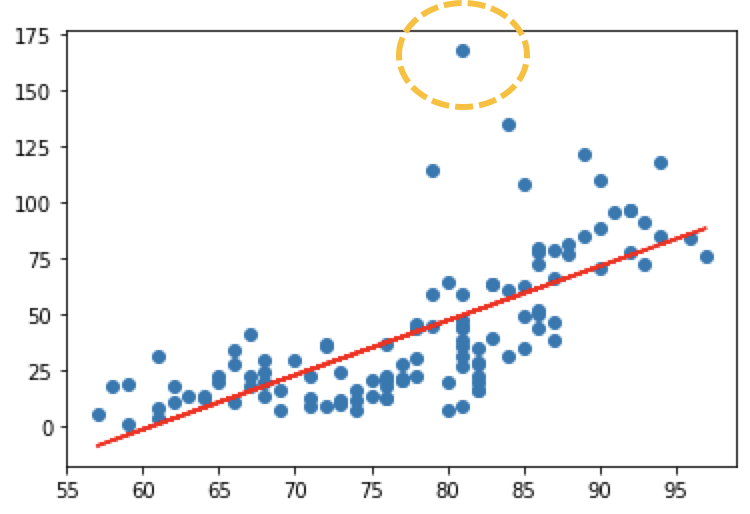

## Simple Linear Regression

이번 시간에는 실제 예제를 가지고 Linear Regression을 이용하여 예측 값을 산출해보도록 하겠습니다.

예제는 하기표처럼 온도와 오존량에 대한 데이터를 Training data로 사용할 예정이며 파일은 추가적으로 제공하도록 하겠습니다.

|      | Ozone | Solar.R | Wind | Temp | Month |  Day |
| ---: | ----: | ------: | ---: | ---: | ----: | ---: |
|    0 |  41.0 |   190.0 |  7.4 |   67 |     5 |    1 |
|    1 |  36.0 |   118.0 |  8.0 |   72 |     5 |    2 |
|    2 |  12.0 |   149.0 | 12.6 |   74 |     5 |    3 |
|    3 |  18.0 |   313.0 | 11.5 |   62 |     5 |    4 |
|    4 |   NaN |     NaN | 14.3 |   56 |     5 |    5 |
|  ... |   ... |     ... |  ... |  ... |   ... |  ... |
|  148 |  30.0 |   193.0 |  6.9 |   70 |     9 |   26 |
|  149 |   NaN |   145.0 | 13.2 |   77 |     9 |   27 |
|  150 |  14.0 |   191.0 | 14.3 |   75 |     9 |   28 |
|  151 |  18.0 |   131.0 |  8.0 |   76 |     9 |   29 |
|  152 |  20.0 |   223.0 | 11.5 |   68 |     9 |   30 |

저번시간과 똑같은 절차로 예측모델을 만들어 보도록 하겠습니다.

>1. Raw Data Loading
>2. Data Preprocessing ( 데이터 전처리 )
>3. Training Data Set
>4. 초기 W, b 세팅
>5. Loss function 정의
>6. 학습 예측 함수생성
>7. 기타 프로그램에사 필요한 변수 정의
>8. 학습진행
>9. 예측값 확인

``` python
import numpy as np
import pandas as pd
import matplotlib.pyplot as plt
from data.my_library.machine_learning_library import numerical_derivative as nd

# 1. Raw Data Loading
df = pd.read_csv('./data/ozone.csv')
# display(df)

# 2. Data Preprocessing(데이터 전처리)
# - 결측치 처리...
# - 삭제, 값을 변경(평균, 최대, 최소), 값을 예측해서 값을 대체 
# - 이상치 처리(outlier)
# - 이상치를 검출하고, 변경하는 작업
# - 데이터 정규화 작업
# - 학습에 필요한 컬럼을 추출, 새로 생성.


# 필요한 column 만 추출
# 결치값을 제거!!


training_data = df[['Temp','Ozone', ]]
# display(training_data)
# print(training_data.shape) #(153, 2)


training_data = training_data.dropna(how='any')
# display(training_data)
# print(training_data.shape) #(116, 2)

# 3. Training Data Set
x_data = training_data['Temp'].values.reshape(-1,1)
t_data = training_data['Ozone'].values.reshape(-1,1)

# 4. Simple Linear Regression
#    y = Wx + b //  W,b를 정의
W = np.random.rand(1,1)
b = np.random.rand(1)

# 5. loss function 정의
def loss_func(x, t):
    y = np.dot(x, W) + b
    return np.mean(np.power(t-y,2)) # 최소제곱법

# 6. 학습종료 후 예측함수
def predict(x):
    return np.dot(x,W) +b

# 7. 기타 프로그램에서 필요한 변수들을 정의
learning_rate = 1e-4

f = lambda x: loss_func(x_data, t_data)

# 8. 학습을 진행
for step in range(30000):
    W -= learning_rate * nd(f, W)
    b -= learning_rate * nd(f, b)
    
    if step %3000 ==0:
        print ('W : {}, b : {}, loss : {}'.format(W, b, loss_func(x_data,t_data)))
    
# 9. 그래프로 확인
plt.scatter(x_data, t_data)
plt.plot(x_data, np.dot(x_data, W)+b, 'r')
plt.show()

print(predict(62))
```

```
W : [[0.48898185]], b : [0.1382576], loss : 903.6007199549715
W : [[0.58275697]], b : [-1.13623806], loss : 861.0875644794504
W : [[0.59874403]], b : [-2.39947113], loss : 855.7685424676351
W : [[0.61459263]], b : [-3.65176381], loss : 850.5412536613877
W : [[0.63030397]], b : [-4.89321085], loss : 845.4041160065931
W : [[0.64587924]], b : [-6.12390617], loss : 840.3555747335402
W : [[0.66131962]], b : [-7.34394289], loss : 835.3941018864972
W : [[0.67662628]], b : [-8.55341332], loss : 830.518195861303
W : [[0.69180037]], b : [-9.75240898], loss : 825.7263809507612
W : [[0.70684304]], b : [-10.94102059], loss : 821.0172068981508
```

<p align='center'></p>

### Scikit-learn

앞선 코드를 통하여 상기의 그래프를 얻었습니다. 육안으로 판단을 해보았을때 y 절편인 b 값이 좀더 내려오고 기울기값인 W 가 높은 값을 가져야만 할 것 같은데요. 물론 그래프의 조정이나 learning_rate를 조정하면서 원하는 결과치를 얻을 수 있겠지만 이번시간에는 `Scikit-learn`을 통해서 좀더 쉽게 최적의 그래프를 얻어보도록 하겠습니다. 코드를 통해서 알아보도록 하겠습니다.

```python
import numpy as np
import pandas as pd
import matplotlib.pyplot as plt 
from sklearn import linear_model

# 1. Raw Data Loading
df = pd.read_csv('./data/ozone.csv')
# display(df)

# 2. Data Preprocessing(데이터 전처리)
# - 결측치 처리...
# - 삭제, 값을 변경(평균, 최대, 최소), 값을 예측해서 값을 대체 
# - 이상치 처리(outlier)
# - 이상치를 검출하고, 변경하는 작업
# - 데이터 정규화 작업
# - 학습에 필요한 컬럼을 추출, 새로 생성.


# 필요한 column 만 추출
# 결치값을 제거!!
#

training_data = df[['Temp','Ozone', ]]


training_data = training_data.dropna(how='any')
# display(training_data)
# print(training_data.shape) #(116, 2)

# 3. Training Data Set
x_data = training_data['Temp'].values.reshape(-1,1)
t_data = training_data['Ozone'].values.reshape(-1,1)

# 4. sklearn을 이용해서 linear regression model 객체를 생성
# 아직 완성되지않은( 학습되지 않은 모델을 일단생성)
model = linear_model.LinearRegression()

# 5. Training Data Set을 이용해서 학습을 진행!
model.fit(x_data, t_data)

# 6. W와 b 값을 알아내야 해요!
print('W:{}, b:{}'.format(model.coef_, model.intercept_)) 
# W:[[2.4287033]], b:[-146.99549097]


# 7. 그래프로 확인해보아요!
plt.scatter(x_data, t_data)
plt.plot(x_data, np.dot(x_data, model.coef_)+model.intercept_, 'r')
plt.show() 

# 8. 예측을 한번 해보아요!!
predict_val = model.predict([[62]])
print(predict_val) #[[3.58411393]]
```

<p align='center'></p>

`Scikit-learn`을 통해서 좀더 쉽게 최적의 그래프를 얻을 수 있었습니다. 그렇다면 왜 이런현상이 발생하는 것일까요?? 바로 데이터의 전처리가 잘안되서 발생하는 문제입니다.

<p align='center'></p>

그래프를 보면 노란색으로 표시된 부분의 데이터가 비정상적으로 튀는 것을 확인할 수 있습니다.

### 이상치 처리(Outlier)

Z-Score (분산, 표준편차를 이용하는 이상치 검출방식 - 통계기반)
Tukey Outlier(4분위값을 이용하는 이상치 검출방식)
이상치(Outlier)는 속성의 값이 일반적인 값보다 편차가 큰 값을 의미.
즉, 데이터 전체 패턴에서 동떨어져 있는 관측치를 지칭!!
평균뿐아니라 분산에도 영향을 미치기 떄문에 결국은 데이터 전체의 
안정성을 저해하는 요소.
그래서 이상치는 반드시 처리해야 하고 이것을 검출하고 처리하는데 상당히 
많은 시간이 소요되는게 일반적