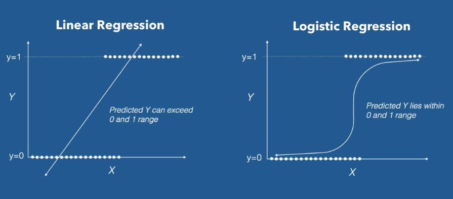
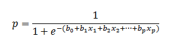
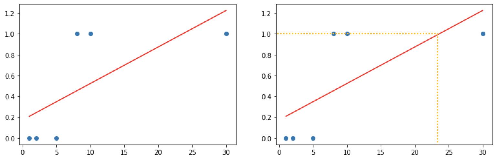

## Tensorflow 

이번시간에는 `Tensorflow`를 이용해서 Linear Regression을 해보도록 하겠습니다.

먼저 Tensorflow를 설치하고 시작해보도록 하겠습니다. Tensorflow는 버전이 1.xx 버전과 2.xx 버전이 있습니다. 이번시간에는 1.15버전을 설치하여 사용하도록 하겠습니다.

``` powershell
$ pip install tensorflow==1.15
```

설치를 하였으니 'Hello World'를 출력해보도록 하겠습니다.

```python
import tensorflow as tf
print(tf.__version__)

node = tf.constant('Hello World')

# 우리가 만든 그래프를 실행하기 위해서 Session이 필요!
sess = tf.Session()

# runner 인 Session 이 생성되었으니 이걸 이용해서 node를 실행해 보아요!
print(sess.run(node)) # b'Hello World' b는 바이트
print(sess.run(node).decode())  #Hello World'
```

이번에는 덧셈을 수행해보도록 하겠습니다.

``` python
# placeholder를 이용
# 2개의 수를 입력으로 받아서 덧셈연산을 수행
import tensorflow as tf
node1 = tf.placeholder(dtype = tf.float32) # scalar 형태의 값 1개를 실수로 받아들일 수 있는 Placeholder
node2 = tf.placeholder(dtype = tf.float32) # scalar 형태의 값 1개를 실수로 받아들일 수 있는 Placeholder
node3 = node1 + node2

sess = tf.Session()
sess.run(node3, feed_dict={node1:30,node2:20})
```

간단한 예제를 통해서 예측모델을 만들어보도록 하겠습니다.

``` python
import tensorflow as tf

# 1. Raw Data Loading
# 2. Data Preprocessing(데이터 전처리)
# 3. Training data set
x_data = [2,4,5,7,10]
t_data = [7,11,13,17,23]

# 4. Weight & bias 정의
W = tf.Variable(tf.random.normal([1]), name = 'weight') # W = np.random.rand(1,1)
b = tf.Variable(tf.random.normal([1]), name = 'bias') # b = np.random.rand(1)

# 5. hypothesis, simple Linear Regression Model
H = W * x_data + b

# 6. Loss function
loss = tf.reduce_mean(tf.square(t_data-H)+b)
#7. train node 생성
optimizer = tf.train.GradientDescentOptimizer(learning_rate = 0.001)
train = optimizer.minimize(loss)

# 8. 실행준비 및 초기화작업
sess = tf.Session()
sess.run(tf.global_variables_initializer()) # 초기화 작업

# 9. 반복해서 학습을 진행!!

for step in range(30000):
    _,W_val, b_val = sess.run([train,W,b])
    if step % 3000 == 0:
        print('W:{}, b:{}'.format(W_val, b_val))
        
print(sess.run(H)) # [ 6.9997516 10.999857  12.999908  17.000013  23.000172 ]

# 10. predict!!
print(sess.run(H, feed_dict={X:[6]})) # [13.111737]
```

### Classfication

Training Data Set 특성과 분포를 파악한 후 미지의 입력데이터에 대해 어떤 종류의 값으로 분류될 수 있는지 예측합니다. 학습 후 예측데이터의 결과를 0혹은 1사이의 실수로 판단하고 0.5이상의 확률을 가진 인자들을 Pass (1) 그 이하인 확률을 Fail (0)으로 판단하여 분류하는 것을 Classification 

### Logistic Regression

이전까지 배웠던 Linear Regression과 더불어 Logistic Regression에 대하여 알아보도록 하겠습니다. Logistic Regression은 0~1사이의 값을 가지는 확률로 표현하기 위하여 사용됩니다.

<p align = 'center'></p>

<p align = 'center'></p>

간단한 예시를 통해서 Logistic  Regression에 대하여 알아보도록 하겠습니다.

공부시간에 따른 시험합격여부에 대한 데이터를 Linear Regression으로 분석하고 합격여부를 알아보도록 하겠습니다.

``` python
import numpy as np
import matplotlib.pyplot as plt
from sklearn import linear_model

# Training Data Set
x_data = np.array([1,2,5,8,10,30]) # 공부시간
t_data = np.array([0,0,0,1,1,1]) # 시험합격여부(0:Fail, 1:Pass)

model = linear_model.LinearRegression()
model.fit(x_data.reshape(-1,1),
         t_data.reshape(-1,1))
print(model.coef_, model.intercept_) # [[0.03500583]] [0.17327888]
model.coef_
plt.scatter(x_data, t_data)
plt.plot(x_data, x_data * model.coef_.ravel() + model.intercept_, 'r')
```

<p align='center'></p>

상기 그래프를 보면 실데이터에서는 8시간 이상 공부를 한다면 충분히 합격을 할 수 있지만 Linear Regression으로 분석을 한다면 24시간 정도를 공부를 해야 시험을 합격할 수 있습니다. 이러한 문제때문에 Classification을 하려고 할때에는 Logistic Regression을 사용한다고 보시면 되겠습니다. 

그렇다면 다른 데이터를 사용해서 한번 구해보도록 하겠습니다.

``` python
# 예측모델 
import tensorflow as tf
import numpy as np

# training data set
# 외국어 공부시간(시간), 해외체류기간(년)
x_data = np.array([[1,0],
                 [2,0],
                 [5,1],
                 [2,3],
                 [3,3],
                 [8,1],
                 [10,0]])


# 시험합격여부(0:Fail, 1:Pass)
t_data = np.array([[0],
                  [0],
                  [0],
                  [1],
                  [1],
                  [1],
                  [1]])
# placeholder
X = tf.placeholder(shape=[None,2], dtype = tf.float32)
T = tf.placeholder(shape=[None,1], dtype = tf.float32)

# Weight & bias
W = tf.Variable(tf.random.normal([2,1]), name = 'weight')
b = tf.Variable(tf.random.normal([1]), name = 'bias')

# Hypothesis(Logistic Model)
logit = tf.matmul(X,W) + b # Linear Regression Hypothesis
H = tf.sigmoid(logit)

# loss function 
loss = tf.reduce_mean(tf.nn.sigmoid_cross_entropy_with_logits(logits = logit, labels=T))


## 8. Training 노드생성
train = tf.train.GradientDescentOptimizer(learning_rate=0.001).minimize(loss)

# Session & 초기화
sess = tf.Session()
sess.run(tf.global_variables_initializer())

# 10. 학습을 진행(Graph를 실행)
for step in range(3000):
    _, W_val,b_val, loss_val = sess.run([train, W,b, loss], feed_dict={X:x_data, T:t_data})
    
    if step%300 ==0:
        print ('W:{}, b:{}, loss:{}'.format(W_val,b_val,loss_val))


# 11. 내가 알고싶은 값을 넣어서 predict!!
# predict_data_x = np.array([[150,8,85]])
# predict_data_x = scaler_x.transform(predict_data_x)
result = sess.run(H, feed_dict={X:[[4,2]]})

# result = scaler_t.inverse_transform(result)

print(result)
```

